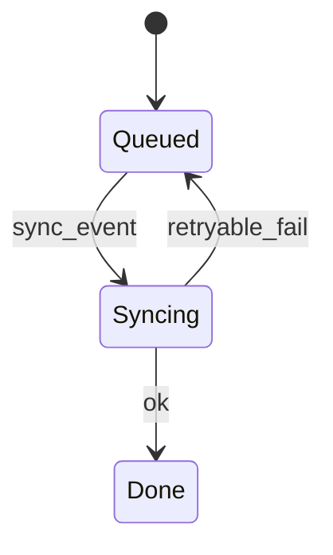
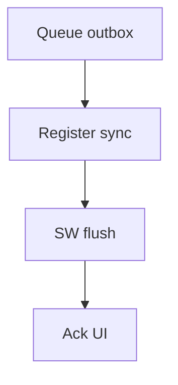
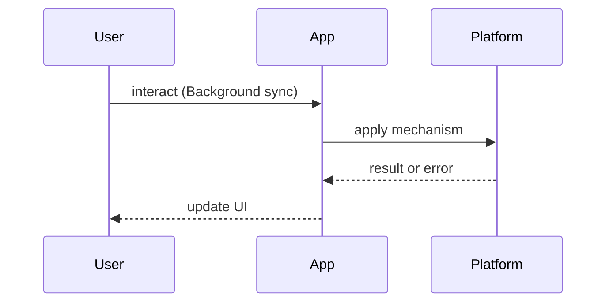

# Background Sync

<TopicMeta />

<Prerequisites />

::: tip Published
This page meets the handbook **published** bar: deep explanation, ≥10 common mistakes, and official references. Further engine-level errata welcome via PR.
:::

## Introduction

**Background Sync** lets a service worker retry work after connectivity returns — classic case: queue a failed POST and flush later. Related to [/21-frontend-system-design/offline-first/](/21-frontend-system-design/offline-first/).

## Why does it exist?

Mobile users submit forms offline. Immediate failure UX is worse than “we’ll send it when you’re back” with durable queues.

## Historical Background

Background Sync API (Chromium-led); Periodic Background Sync for regular fetches. Support is uneven — always feature-detect and provide fallbacks.

## Mental Model

**Outbox in IDB + sync event**: tag a sync, SW wakes on connectivity, drains outbox idempotently.

## Internal Workflow

1. On failed mutate, write outbox  
2. `registration.sync.register('outbox')`  
3. SW `sync` handler drains  
4. Notify clients of success/failure  
5. Fallback: retry on next focus if API missing

## Lifecycle



## Browser Perspective

Check support; Safari gaps historically. Periodic Sync needs engagement heuristics.

## JavaScript Engine Perspective

Not applicable.

## React Perspective

UI reads outbox pending state from IDB.

## Next.js Perspective

Not applicable.

## Server Perspective

Idempotency keys required.

## Network Perspective

Replay storms after outages — backoff.

## Memory Perspective

Bound outbox size.

## Performance

Batch replays; avoid waking for tiny chatty events.

## Production Example

A field app queues inspection drafts; sync flushes with idempotency keys; UI shows pending badges.

## Code Examples

```js
// page
await idbAdd({ url: '/api/orders', body })
await navigator.serviceWorker.ready.then((reg) => reg.sync.register('orders'))

// sw
self.addEventListener('sync', (event) => {
  if (event.tag === 'orders') event.waitUntil(flushOrders())
})
```

## Diagrams





## Common Mistakes

1. Replaying non-idempotent POSTs without keys
2. Assuming universal browser support
3. No user-visible pending state
4. Infinite retry on 400 validation errors
5. Storing sensitive payloads unencrypted without threat model
6. Relying only on in-memory queues
7. Missing a production edge case for 23-pwa-and-offline.background-sync (#1)
8. Missing a production edge case for 23-pwa-and-offline.background-sync (#2)
9. Missing a production edge case for 23-pwa-and-offline.background-sync (#3)
10. Missing a production edge case for 23-pwa-and-offline.background-sync (#4)


## Best Practices

- IDB durability
- Idempotency keys
- Feature detect + fallback
- Drop permanent failures

## Anti-patterns

- Silent data loss when sync unsupported

## Comparison

| Approach | Durability | Support |
| --- | --- | --- |
| Background Sync | High | Partial |
| Retry on focus | Medium | Wide |
| Manual “Retry” button | High UX control | Wide |

## Interview Questions

### Easy

**Q:** What problem does background sync solve?

**A:** Reliably retrying deferred network work when connectivity returns.

### Medium

**Q:** Why idempotency keys?

**A:** Sync may fire more than once; servers must not double-charge/create.

### Hard

**Q:** Design a cross-browser offline submit pipeline.

**A:** IDB outbox always; Background Sync when available; else resume on `online`/visibility; server idempotency; conflict UX.

## Summary

- Outbox + sync event
- Idempotent replays
- Feature-detect
- Show pending state

## References

- [MDN — Background Synchronization API](https://developer.mozilla.org/en-US/docs/Web/API/Background_Synchronization_API)
- [web.dev — Background sync](https://web.dev/articles/background-sync)

<RelatedTopics />


Prev: [`23-pwa-and-offline.caching-strategies-sw`](/23-pwa-and-offline/caching-strategies-sw/) · Next: [`23-pwa-and-offline.web-app-manifest`](/23-pwa-and-offline/web-app-manifest/)
