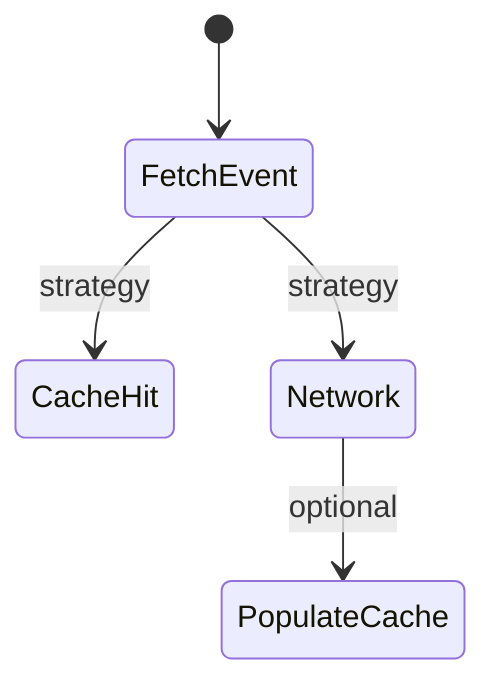
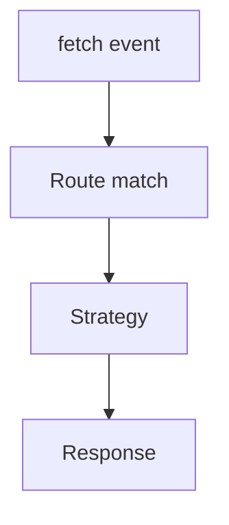
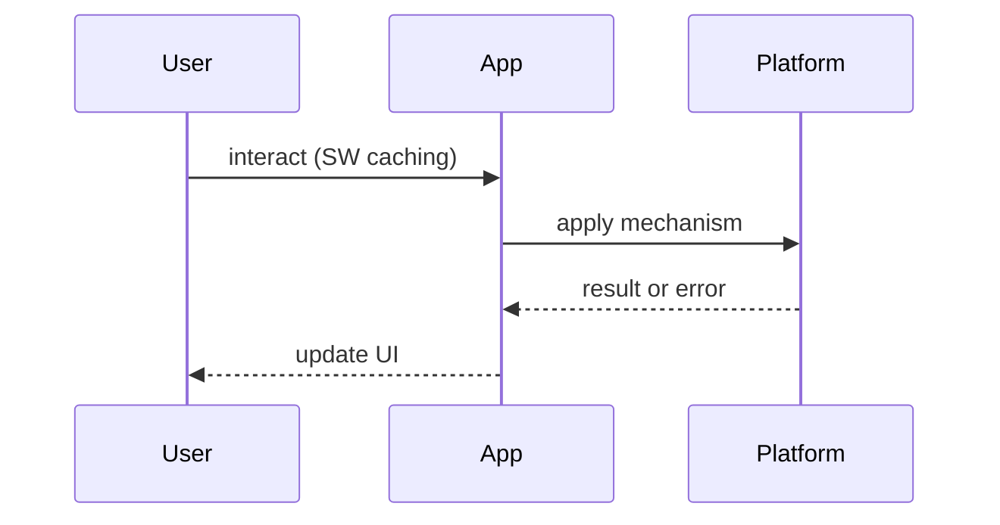

# Service Worker Caching Strategies

<TopicMeta />

<Prerequisites />

::: tip Published
This page meets the handbook **published** bar: deep explanation, ≥10 common mistakes, and official references. Further engine-level errata welcome via PR.
:::

## Introduction

**Service Worker Caching Strategies** decide whether a `fetch` event answers from Cache Storage, the network, or both. Prerequisite lifecycle: [/23-pwa-and-offline/service-worker-lifecycle/](/23-pwa-and-offline/service-worker-lifecycle/). HTTP layer: [/02-internet/http-caching/](/02-internet/http-caching/).

## Why does it exist?

One strategy does not fit HTML, hashed JS, and API JSON. Wrong choices serve stale checkouts or defeat offline goals.

## Historical Background

Workbox popularized named strategies on top of the Cache API. Patterns mirror HTTP SWR but run in the worker.

## Mental Model

| Resource | Typical strategy |
| --- | --- |
| Hashed static assets | Cache-first |
| HTML navigations | Network-first |
| Semi-static JSON | SWR |
| Non-GET / auth APIs | Network-only |

Always version caches and bound growth.

## Internal Workflow

1. Classify routes/assets  
2. Implement routers in `fetch`  
3. Precache shell  
4. Runtime cache with expiration  
5. Test offline + update

## Lifecycle



## Browser Perspective

Cache Storage is origin-scoped; opaque responses have quirks (especially CORS modes).

## JavaScript Engine Perspective

Not applicable.

## React Perspective

App still needs offline UX messaging — [/23-pwa-and-offline/offline-ux/](/23-pwa-and-offline/offline-ux/).

## Next.js Perspective

Do not cache personalized HTML broadly.

## Server Perspective

ETags still help when revalidating.

## Network Perspective

Network-first needs timeouts before falling back to cache.

## Memory Perspective

QuotaExceededError — expire old entries.

## Performance

SWR gives instant UI with background refresh — excellent for feeds.

## Production Example

Workbox routes: precache build assets, network-first for document, SWR for avatar images with expiration plugin.

## Code Examples

```js
self.addEventListener('fetch', (event) => {
  const req = event.request
  if (req.mode === 'navigate') {
    event.respondWith(
      fetch(req).catch(() => caches.match('/offline.html')),
    )
    return
  }
  event.respondWith(
    caches.match(req).then((hit) => hit || fetch(req)),
  )
})
```

## Diagrams





## Common Mistakes

1. Cache-first for HTML forever
2. Caching POST responses
3. No expiration for runtime caches
4. Ignoring opaque response caching limits
5. Same strategy for authenticated APIs and public assets
6. Forgetting offline fallback document
7. Missing a production edge case for 23-pwa-and-offline.caching-strategies-sw (#1)
8. Missing a production edge case for 23-pwa-and-offline.caching-strategies-sw (#2)
9. Missing a production edge case for 23-pwa-and-offline.caching-strategies-sw (#3)
10. Missing a production edge case for 23-pwa-and-offline.caching-strategies-sw (#4)


## Best Practices

- Per-resource routing
- Timeouts on network-first
- Cache versioning + cleanup
- Workbox or equivalent battle-tested helpers

## Anti-patterns

- cache.addAll entire site on install

## Comparison

| Strategy | Offline | Freshness |
| --- | --- | --- |
| Cache-first | Great | Risk stale |
| Network-first | Fallback | Fresher |
| SWR | Great | Background fresh |

## Interview Questions

### Easy

**Q:** When use cache-first?

**A:** Immutable hashed static assets where any cached version is fine until a new filename appears.

### Medium

**Q:** Explain stale-while-revalidate in a SW.

**A:** Return cache immediately, update cache from network in parallel, next request gets fresher bytes.

### Hard

**Q:** Design caching for an authenticated dashboard PWA.

**A:** Network-only or short network-first for private JSON; never share caches across users; careful with navigation HTML; explicit logout cache clears.

## Summary

- Route by resource class
- SWR/cache-first/network-first intentionally
- Expire & version
- Don’t cache private data casually

## References

- [Workbox strategies](https://developer.chrome.com/docs/workbox/modules/workbox-strategies)
- [MDN — Cache](https://developer.mozilla.org/en-US/docs/Web/API/Cache)

<RelatedTopics />


Prev: [`23-pwa-and-offline.service-worker-lifecycle`](/23-pwa-and-offline/service-worker-lifecycle/) · Next: [`23-pwa-and-offline.background-sync`](/23-pwa-and-offline/background-sync/)
