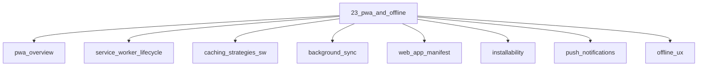

# PWA and Offline

## Scope

Service workers, caching strategies, and offline UX

## Prerequisites

See the learning paths and each topic's prerequisites in the registry.

## Topics in order

- [PWA Overview](/23-pwa-and-offline/pwa-overview/) — junior, ~25 min
- [Service Worker Lifecycle](/23-pwa-and-offline/service-worker-lifecycle/) — mid, ~40 min
- [Service Worker Caching Strategies](/23-pwa-and-offline/caching-strategies-sw/) — mid, ~40 min
- [Background Sync](/23-pwa-and-offline/background-sync/) — senior, ~25 min
- [Web App Manifest](/23-pwa-and-offline/web-app-manifest/) — junior, ~20 min
- [Installability](/23-pwa-and-offline/installability/) — junior, ~20 min
- [Push Notifications](/23-pwa-and-offline/push-notifications/) — mid, ~30 min
- [Offline UX](/23-pwa-and-offline/offline-ux/) — mid, ~25 min

## Module knowledge graph

## Suggested learning paths

Browse [Learning Paths](/learning-paths/).
