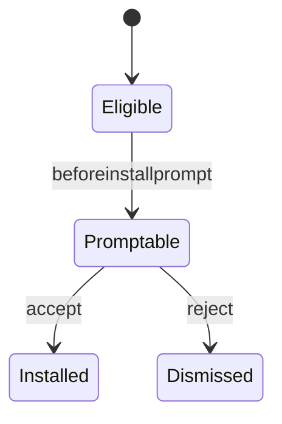
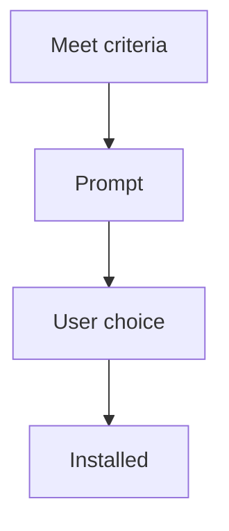
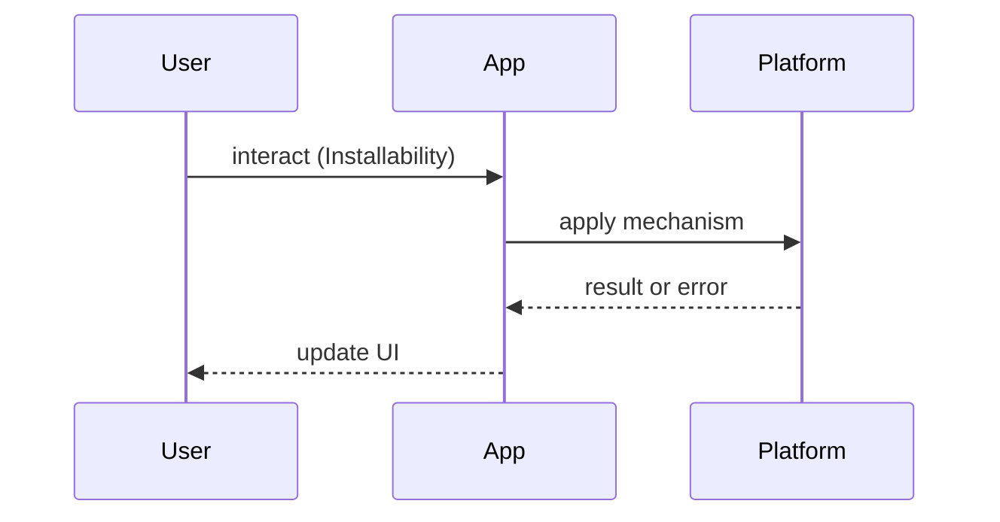

# Installability

<TopicMeta />

<Prerequisites />

::: tip Published
This page meets the handbook **published** bar: deep explanation, ≥10 common mistakes, and official references. Further engine-level errata welcome via PR.
:::

## Introduction

**Installability** is whether and how browsers offer “Install app.” Criteria typically include manifest fields, icons, a service worker controlling the page, and user engagement signals (engine-specific).

## Why does it exist?

Install increases retention and enables standalone display. Bad prompts annoy users; missing criteria silently prevent install.

## Historical Background

Chrome’s installability heuristics evolved; `beforeinstallprompt` enabled custom buttons. iOS uses Share → Add to Home Screen with different rules.

## Mental Model

Meet **technical criteria** → browser may fire install affordance → user consents → app appears installed. Never fake a prompt that doesn’t install.

## Internal Workflow

1. Satisfy manifest + SW  
2. Listen for `beforeinstallprompt` (Chromium)  
3. Offer an in-app Install button  
4. Handle `appinstalled`  
5. Provide iOS instructions fallback

## Lifecycle



## Browser Perspective

Chromium custom prompt; Safari manual; check caniuse / MDN for current rules.

## JavaScript Engine Perspective

Not applicable.

## React Perspective

Store deferred prompt event in state for a button.

## Next.js Perspective

Not applicable.

## Server Perspective

Not applicable.

## Network Perspective

Not applicable.

## Memory Perspective

Not applicable.

## Performance

Install itself isn’t a runtime perf feature; standalone can reduce browser chrome clutter.

## Production Example

In-app “Install” appears after engagement; dismissed users aren’t nagged weekly.

## Code Examples

```ts
let deferred: BeforeInstallPromptEvent | null = null
window.addEventListener('beforeinstallprompt', (e) => {
  e.preventDefault()
  deferred = e as BeforeInstallPromptEvent
})

async function install() {
  if (!deferred) return
  deferred.prompt()
  await deferred.userChoice
  deferred = null
}
```

## Diagrams





## Common Mistakes

1. Calling prompt without a user gesture when required
2. Nagging install banners on first paint
3. Ignoring iOS’s different path
4. Missing SW so criteria fail
5. Broken icons failing installability
6. Assuming install works in all in-app browsers
7. Missing a production edge case for 23-pwa-and-offline.installability (#1)
8. Missing a production edge case for 23-pwa-and-offline.installability (#2)
9. Missing a production edge case for 23-pwa-and-offline.installability (#3)
10. Missing a production edge case for 23-pwa-and-offline.installability (#4)


## Best Practices

- Custom install button after value is clear
- Track accept/dismiss rates
- Document iOS steps

## Anti-patterns

- Full-screen blocking “Install now” walls

## Comparison

| Platform | Prompt |
| --- | --- |
| Chromium | beforeinstallprompt |
| iOS Safari | Manual Add to Home Screen |
| Firefox | Varies by OS |

## Interview Questions

### Easy

**Q:** What is beforeinstallprompt?

**A:** A Chromium event allowing sites to defer and trigger the install dialog from their own UI.

### Medium

**Q:** Why might a site fail installability with a manifest present?

**A:** Missing SW control, insufficient icons, wrong display/start_url, or non-HTTPS — check DevTools Manifest panel.

### Hard

**Q:** Design install UX that respects users across iOS and Android.

**A:** Feature-detect capabilities; Android custom button; iOS instructional UI; no dark patterns; measure conversion.

## Summary

- Criteria then prompt
- Custom UX via deferred prompt
- iOS differs
- Don’t nag

## References

- [web.dev — Installable](https://web.dev/learn/pwa/install)
- [MDN — beforeinstallprompt](https://developer.mozilla.org/en-US/docs/Web/API/Window/beforeinstallprompt_event)

<RelatedTopics />


Prev: [`23-pwa-and-offline.web-app-manifest`](/23-pwa-and-offline/web-app-manifest/) · Next: [`23-pwa-and-offline.push-notifications`](/23-pwa-and-offline/push-notifications/)
