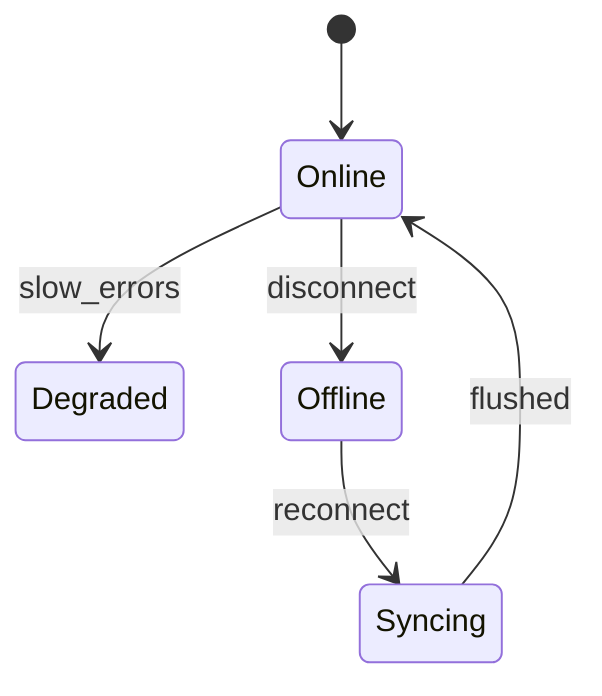
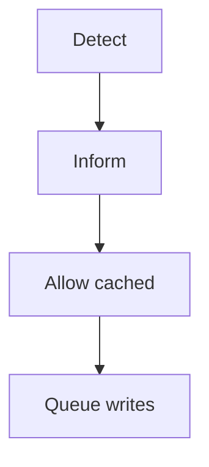
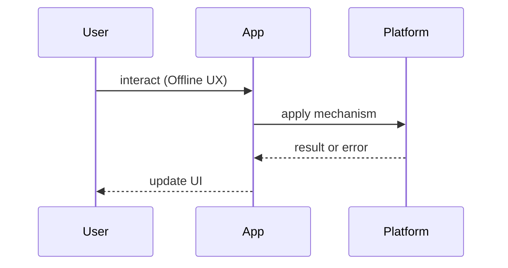

# Offline UX

<TopicMeta />

<Prerequisites />

::: tip Published
This page meets the handbook **published** bar: deep explanation, ≥10 common mistakes, and official references. Further engine-level errata welcome via PR.
:::

## Introduction

**Offline UX** is how the product communicates connectivity and deferred work. Caching technology without UX leaves users staring at broken buttons.

Pairs with [/21-frontend-system-design/offline-first/](/21-frontend-system-design/offline-first/).

## Why does it exist?

Connectivity is a continuum (slow 3G ≠ offline). Users need to know what still works, what is pending, and what failed permanently.

## Historical Background

From brutal “You are offline” interstitials to nuanced offline-first UIs with local data and sync indicators (popularized by mobile apps and PWAs).

## Mental Model

Show **capability**, not just connectivity: readable cached content, disabled illegal actions, pending outbox counts, and recoverable errors.

## Internal Workflow

1. Detect `navigator.onLine` + real request failures  
2. Banner/status region (ARIA live)  
3. Allow cached reads  
4. Queue or disable writes  
5. Confirm sync success

## Lifecycle



## Browser Perspective

`online`/`offline` events are hints — verify with network calls.

## JavaScript Engine Perspective

Not applicable.

## React Perspective

Global status provider; keep banners from shifting layout (reserve space / CLS).

## Next.js Perspective

Not applicable.

## Server Perspective

Return clear error codes for sync conflicts.

## Network Perspective

Timeouts vs offline distinction matters for copy.

## Memory Perspective

Not applicable.

## Performance

Don’t block the whole app on connectivity checks.

## Production Example

Gmail-like “Pending…” on sends; docs apps show offline badges on files; forms keep local drafts.

## Code Examples

```tsx
function ConnectivityBanner() {
  const [online, setOnline] = useState(navigator.onLine)
  useEffect(() => {
    const on = () => setOnline(true)
    const off = () => setOnline(false)
    window.addEventListener('online', on)
    window.addEventListener('offline', off)
    return () => {
      window.removeEventListener('online', on)
      window.removeEventListener('offline', off)
    }
  }, [])
  if (online) return null
  return (
    <div role="status" aria-live="polite">
      You are offline. Changes will sync when you reconnect.
    </div>
  )
}
```

## Diagrams





## Common Mistakes

1. Full-screen hard stop when cached content exists
2. Trusting `navigator.onLine` alone
3. No pending indicators for queued writes
4. Layout-shifting banners hurting CLS
5. Identical copy for timeout vs offline
6. Letting users edit without telling them it won’t save
7. Missing a production edge case for 23-pwa-and-offline.offline-ux (#1)
8. Missing a production edge case for 23-pwa-and-offline.offline-ux (#2)
9. Missing a production edge case for 23-pwa-and-offline.offline-ux (#3)
10. Missing a production edge case for 23-pwa-and-offline.offline-ux (#4)


## Best Practices

- ARIA live status
- Differentiate degraded vs offline
- Local drafts
- Success toasts after sync

## Anti-patterns

- Fake spinners that never resolve offline

## Comparison

| UX | Trust |
| --- | --- |
| Hard interstitial | Low for content apps |
| Banner + cached UI | High |
| Silent failure | Lowest |

## Interview Questions

### Easy

**Q:** Why is offline UX more than a red banner?

**A:** Users need to know what still works and what will sync — not only that a cable is unplugged.

### Medium

**Q:** Why is navigator.onLine insufficient?

**A:** It can report online when captive portals/DNS fail; confirm with real requests.

### Hard

**Q:** Design offline UX for collaborative editing.

**A:** Local draft, presence unavailable, conflict resolution UI on sync, clear “offline edits” labeling — see CRDT/LWW choices in offline-first.

## Summary

- Communicate capability
- Queue or disable writes
- Don’t trust onLine alone
- Preserve layout and a11y

## References

- [web.dev — Offline UX](https://web.dev/articles/offline-ux)
- [MDN — Navigator.onLine](https://developer.mozilla.org/en-US/docs/Web/API/Navigator/onLine)

<RelatedTopics />


Prev: [`23-pwa-and-offline.push-notifications`](/23-pwa-and-offline/push-notifications/)
