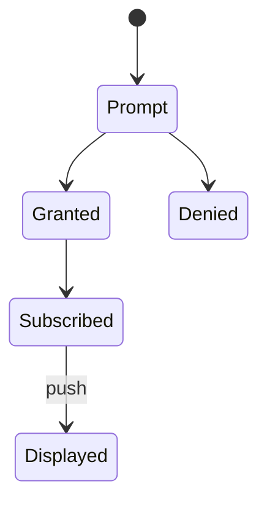
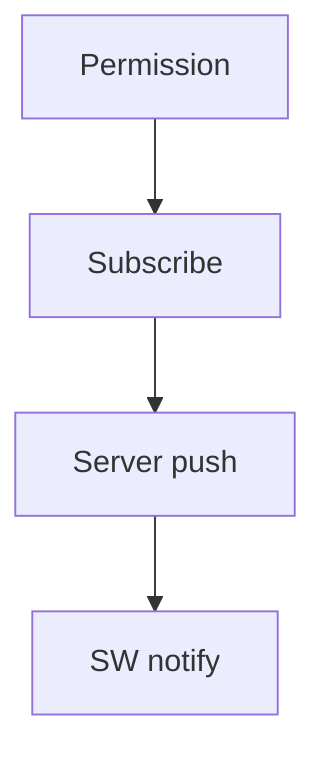
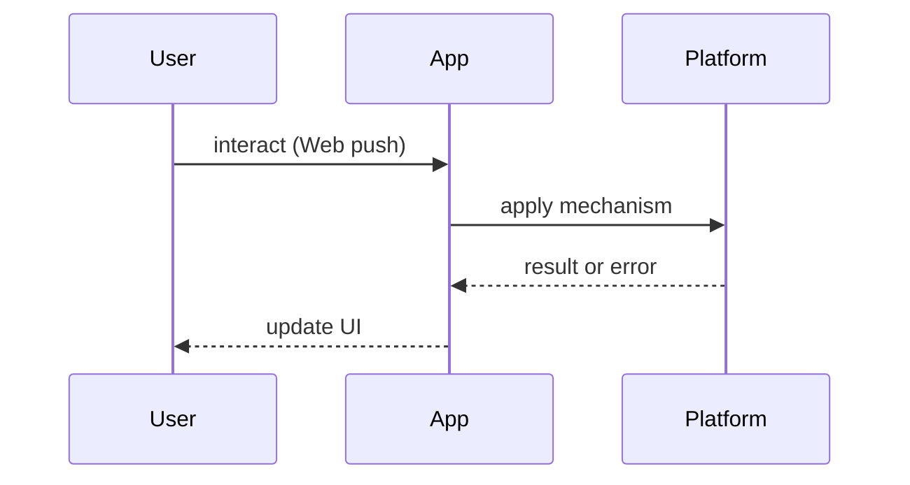

# Push Notifications

<TopicMeta />

<Prerequisites />

::: tip Published
This page meets the handbook **published** bar: deep explanation, ≥10 common mistakes, and official references. Further engine-level errata welcome via PR.
:::

## Introduction

**Push Notifications** deliver messages to users when the site may not be open, via the Push API to a service worker that displays a Notification. High power — easy to abuse.

## Why does it exist?

Re-engagement for chat, shipping, breaking news. Poor use drives permission denials and browser interventions.

## Historical Background

Web Push (VAPID) + Notifications API matured in Chromium; Safari support improved later. Permission UX tightened industry-wide.

## Mental Model

**Permission → subscribe (endpoint + keys) → server pushes → SW `push` → `showNotification` → user click → focus/open clients.**

## Internal Workflow

1. Explain value before permission  
2. Request permission  
3. `pushManager.subscribe` with VAPID key  
4. Store subscription server-side  
5. Send via push service  
6. Handle clicks in SW

## Lifecycle



## Browser Perspective

Permission is per-origin. Quiet notification restrictions may apply.

## JavaScript Engine Perspective

Not applicable.

## React Perspective

UI only for preference center; SW handles display.

## Next.js Perspective

Server stores subscriptions; never commit private keys to the client bundle.

## Server Perspective

Use Web Push protocol with VAPID; handle expired endpoints.

## Network Perspective

Push services (FCM, etc.) deliver to browsers.

## Memory Perspective

Not applicable.

## Performance

Don’t spam — OS will throttle. Keep payloads small.

## Production Example

A parcel tracker asks for push after a user tracks a package; preference center can revoke.

## Code Examples

```js
const sub = await registration.pushManager.subscribe({
  userVisibleOnly: true,
  applicationServerKey: urlBase64ToUint8Array(PUBLIC_VAPID),
})
await fetch('/api/push/subscribe', { method: 'POST', body: JSON.stringify(sub) })

self.addEventListener('push', (event) => {
  const data = event.data?.json() ?? {}
  event.waitUntil(self.registration.showNotification(data.title, { body: data.body }))
})
```

## Diagrams





## Common Mistakes

1. Asking permission on first visit
2. Push without user-visible notification when required
3. Leaking VAPID private key to the client
4. No unsubscribe path
5. Sending marketing spam and burning trust
6. Not handling 410 Gone expired subscriptions
7. Missing a production edge case for 23-pwa-and-offline.push-notifications (#1)
8. Missing a production edge case for 23-pwa-and-offline.push-notifications (#2)
9. Missing a production edge case for 23-pwa-and-offline.push-notifications (#3)
10. Missing a production edge case for 23-pwa-and-offline.push-notifications (#4)


## Best Practices

- Contextual permission asks
- Preference center
- userVisibleOnly
- Expire stale endpoints

## Anti-patterns

- Newsletters-as-push every hour

## Comparison

| Channel | Needs open page? |
| --- | --- |
| In-app toast | Yes |
| Web Push | No |
| Email | No |

## Interview Questions

### Easy

**Q:** Which worker shows the notification for Web Push?

**A:** The service worker on `push` events calls `showNotification`.

### Medium

**Q:** What is VAPID?

**A:** Voluntary Application Server Identification — keys identifying your application server to push services.

### Hard

**Q:** How do you design permission UX that maximizes grant rate ethically?

**A:** Ask after value moment, explain benefits, provide samples, easy opt-out; never dark-pattern traps.

## Summary

- Permission then subscribe
- SW displays notifications
- Protect VAPID private keys
- Earn the right to notify

## References

- [MDN — Push API](https://developer.mozilla.org/en-US/docs/Web/API/Push_API)
- [MDN — Notifications API](https://developer.mozilla.org/en-US/docs/Web/API/Notifications_API)
- [web.dev — Push notifications](https://web.dev/articles/push-notifications-overview)

<RelatedTopics />


Prev: [`23-pwa-and-offline.installability`](/23-pwa-and-offline/installability/) · Next: [`23-pwa-and-offline.offline-ux`](/23-pwa-and-offline/offline-ux/)
