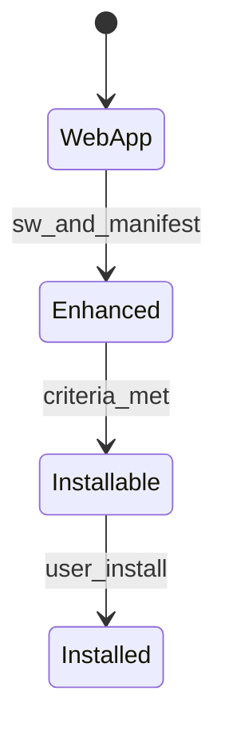
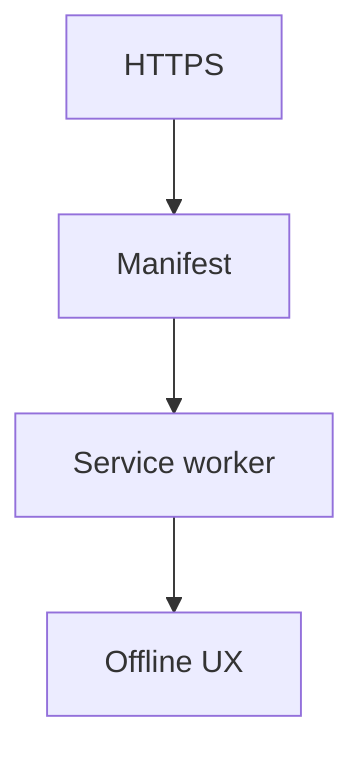
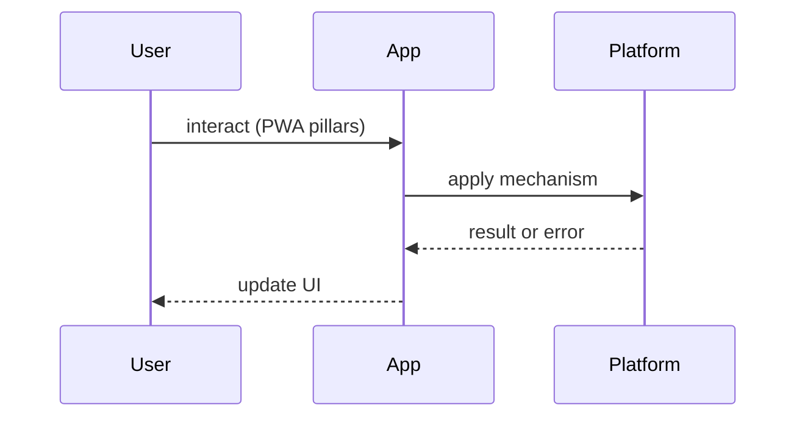

# PWA Overview

<TopicMeta />

<Prerequisites />

::: tip Published
This page meets the handbook **published** bar: deep explanation, ≥10 common mistakes, and official references. Further engine-level errata welcome via PR.
:::

## Introduction

A **Progressive Web App (PWA)** is a web application that uses modern platform features to deliver an app-like experience: installable, progressively enhanced, and resilient on flaky networks.

This overview maps the pieces; deep dives follow in sibling topics and [/09-browser-apis/service-workers/](/09-browser-apis/service-workers/).

## Why does it exist?

Users expect home-screen icons, push, and offline tolerance without forcing a store binary for every product. PWAs reuse web deployment while closing the gap with native shells.

## Historical Background

Chrome’s “Progressive Web Apps” framing (2015) unified service workers, manifests, and HTTPS requirements. Capabilities expanded (file handlers, badging) while iOS support historically lagged and still differs.

## Mental Model

Three pillars: **capable** (APIs), **reliable** (SW + caching), **installable** (manifest + criteria). HTTPS is table stakes. Enhance progressively — core content should work without SW.

## Internal Workflow

1. Serve HTTPS  
2. Add web app manifest  
3. Register a service worker  
4. Choose caching/offline UX  
5. Meet installability criteria  
6. Optionally add push/sync

## Lifecycle



## Browser Perspective

Chromium, Firefox, and Safari differ on install UI and APIs. Always verify target engines.

## JavaScript Engine Perspective

SW runs on a separate worker thread; main thread stays for UI.

## React Perspective

PWA concerns are mostly orthogonal to React — treat SW as infrastructure.

## Next.js Perspective

Framework plugins can inject manifests/SW; understand what they cache.

## Server Perspective

Correct headers and HTTPS; avoid caching HTML incorrectly at CDN.

## Network Perspective

Offline-first strategies defined in [/23-pwa-and-offline/caching-strategies-sw/](/23-pwa-and-offline/caching-strategies-sw/).

## Memory Perspective

Caches grow — quota management matters.

## Performance

A good SW improves repeat visits; a bad SW serves stale shells forever. Precache only critical assets.

## Production Example

A news PWA precaches the app shell, network-first for articles, and offers install + offline reading list.

## Code Examples

```js
if ('serviceWorker' in navigator) {
  window.addEventListener('load', () => {
    navigator.serviceWorker.register('/sw.js')
  })
}
```

## Diagrams





## Common Mistakes

1. Calling any HTTPS site a PWA without SW/manifest
2. Caching everything including API POSTs blindly
3. Ignoring Safari/iOS gaps
4. No update strategy for new SW versions
5. Blocking first visit on SW install
6. Treating PWA as only “Add to Home Screen”
7. Missing a production edge case for 23-pwa-and-offline.pwa-overview (#1)
8. Missing a production edge case for 23-pwa-and-offline.pwa-overview (#2)
9. Missing a production edge case for 23-pwa-and-offline.pwa-overview (#3)
10. Missing a production edge case for 23-pwa-and-offline.pwa-overview (#4)


## Best Practices

- Progressive enhancement
- Explicit cache versioning
- Honest offline UX
- Test install on real devices

## Anti-patterns

- App shell that never updates
- Requiring install to use basic features

## Comparison

| | Web PWA | Store app |
| --- | --- | --- |
| Distribution | URL | Stores |
| Capabilities | Growing | Broadest |
| Update speed | Instant deploy | Review cycles |

## Interview Questions

### Easy

**Q:** Name three PWA ingredients.

**A:** HTTPS, web app manifest, service worker — plus a sensible offline story.

### Medium

**Q:** Why must PWAs be served over HTTPS?

**A:** Service workers are powerful (network interception); browsers require secure contexts to prevent MITM injection.

### Hard

**Q:** How do you design a PWA that still works when the SW fails to activate?

**A:** Network path remains functional; SW is enhancement. Feature-detect APIs; never make first paint depend on SW.

## Summary

- Capable, reliable, installable
- SW + manifest + HTTPS
- Engine differences matter
- Enhance, don’t require

## References

- [web.dev — Progressive Web Apps](https://web.dev/explore/progressive-web-apps)
- [MDN — Progressive web apps](https://developer.mozilla.org/en-US/docs/Web/Progressive_web_apps)

<RelatedTopics />


Next: [`23-pwa-and-offline.service-worker-lifecycle`](/23-pwa-and-offline/service-worker-lifecycle/)
