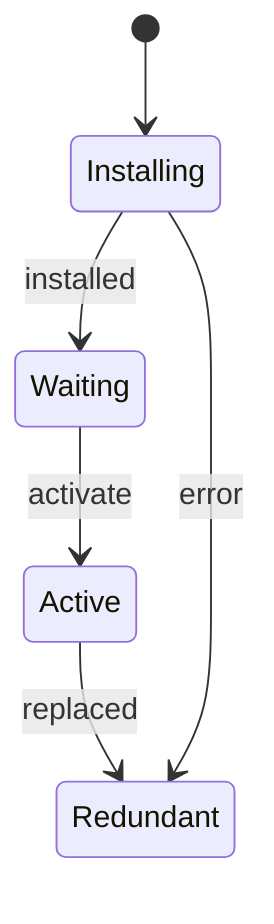
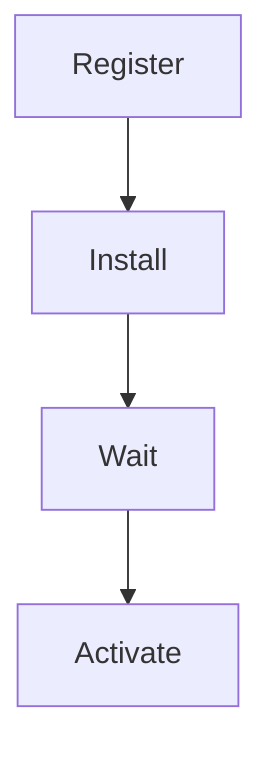
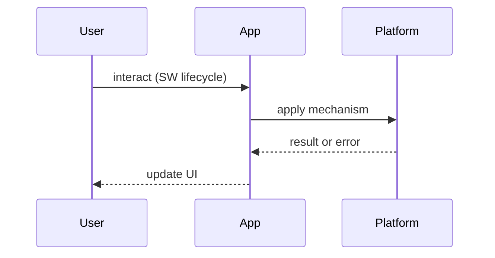

# Service Worker Lifecycle

<TopicMeta />

<Prerequisites />

::: tip Published
This page meets the handbook **published** bar: deep explanation, ≥10 common mistakes, and official references. Further engine-level errata welcome via PR.
:::

## Introduction

The **Service Worker Lifecycle** defines how a worker script is registered, installed, waits, activates, controls pages, and updates. Misunderstanding it causes “why is my cache stuck?” bugs.

Prerequisite: [/09-browser-apis/service-workers/](/09-browser-apis/service-workers/).

## Why does it exist?

SWs can intercept every request. Browsers therefore stage updates carefully so tabs aren’t yanked mid-session without rules.

## Historical Background

Service Workers replaced the broken Application Cache with an explicit lifecycle and Cache API.

## Mental Model

States: **parsed → installing → waiting → active → redundant**. A new SW waits until old clients release control unless you `skipWaiting` + `clients.claim` (with eyes open).

## Internal Workflow

1. Register  
2. `install` → precache  
3. `activate` → delete old caches  
4. `fetch` handlers run when controlling  
5. Updates check on navigation; waiting SW swaps per policy

## Lifecycle



## Browser Perspective

Chrome Application panel shows versions and clients. Updates checked roughly on navigations / periodically.

## JavaScript Engine Perspective

Worker thread — no DOM access.

## React Perspective

UI should listen for `controllerchange` to prompt refresh.

## Next.js Perspective

Build tooling emits hashed assets; SW must not cache HTML forever without plan.

## Server Perspective

Serve `sw.js` with short cache or `no-cache` so updates are visible.

## Network Perspective

Fetch event can bypass or hit Cache Storage.

## Memory Perspective

Old caches linger until activate cleanup.

## Performance

Precache wisely; huge install events fail or delay readiness.

## Production Example

On activate, delete caches not in the allowlist; show “Update available” toast instead of blind `skipWaiting` for critical apps.

## Code Examples

```js
self.addEventListener('install', (event) => {
  event.waitUntil(caches.open('v2').then((c) => c.addAll(['/', '/app.js'])))
})

self.addEventListener('activate', (event) => {
  event.waitUntil(
    caches.keys().then((keys) =>
      Promise.all(keys.filter((k) => k !== 'v2').map((k) => caches.delete(k))),
    ),
  )
})
```

## Diagrams





## Common Mistakes

1. Caching `sw.js` aggressively at the CDN
2. Never deleting old caches
3. Blind skipWaiting breaking in-flight UX
4. Assuming SW controls the page that registered it immediately
5. Importing huge bundles into SW
6. No UI for updates
7. Missing a production edge case for 23-pwa-and-offline.service-worker-lifecycle (#1)
8. Missing a production edge case for 23-pwa-and-offline.service-worker-lifecycle (#2)
9. Missing a production edge case for 23-pwa-and-offline.service-worker-lifecycle (#3)
10. Missing a production edge case for 23-pwa-and-offline.service-worker-lifecycle (#4)


## Best Practices

- Versioned cache names
- Short cache for SW script
- Explicit update UX
- Cleanup on activate

## Anti-patterns

- Single eternal cache name forever

## Comparison

| Update style | UX | Risk |
| --- | --- | --- |
| Wait for tabs to close | Calm | Slow updates |
| skipWaiting + claim | Immediate | Mid-session shifts |

## Interview Questions

### Easy

**Q:** Name key SW lifecycle events.

**A:** `install`, `activate`, plus `fetch`/`message` while active.

### Medium

**Q:** What does waiting mean?

**A:** A new worker is installed but an older active worker still controls clients until it can take over.

### Hard

**Q:** How do you ship a breaking SW change safely?

**A:** Version caches, activate cleanup, prompt users to refresh, avoid claiming instantly on critical flows, monitor error rates.

## Summary

- Install → wait → activate
- Control is explicit
- Version caches
- Plan updates UX

## References

- [MDN — Service Worker lifecycle](https://developer.mozilla.org/en-US/docs/Web/API/Service_Worker_API/Using_Service_Workers)
- [web.dev — Service worker lifecycle](https://web.dev/articles/service-worker-lifecycle)

<RelatedTopics />


Prev: [`23-pwa-and-offline.pwa-overview`](/23-pwa-and-offline/pwa-overview/) · Next: [`23-pwa-and-offline.caching-strategies-sw`](/23-pwa-and-offline/caching-strategies-sw/)
