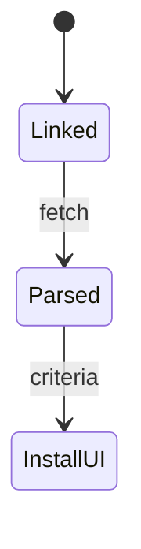
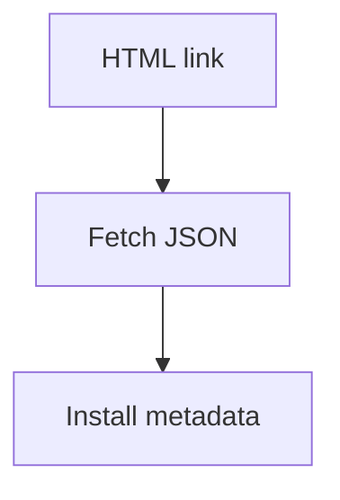
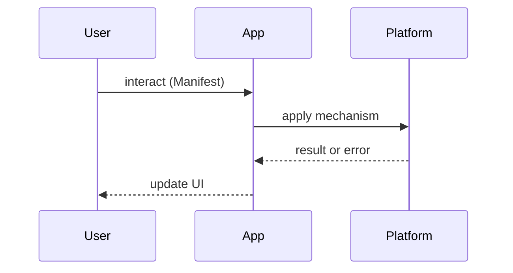

# Web App Manifest

<TopicMeta />

<Prerequisites />

::: tip Published
This page meets the handbook **published** bar: deep explanation, ≥10 common mistakes, and official references. Further engine-level errata welcome via PR.
:::

## Introduction

The **Web App Manifest** is a JSON resource linked from HTML that describes how the app should appear when installed: name, icons, `display`, `start_url`, theme colors, and more.

## Why does it exist?

Without a manifest, browsers lack metadata for install UX and standalone display. It is required for installability on most platforms.

## Historical Background

W3C Web App Manifest evolved with PWA install criteria; fields like `shortcuts`, `protocol_handlers`, `file_handlers` expanded capabilities.

## Mental Model

Manifest = **install-time product identity**. HTML `<link rel="manifest">` points to it. Icons must meet size/purpose requirements.

## Internal Workflow

1. Author `manifest.webmanifest`  
2. Link from all entry HTML  
3. Provide icons (192/512, maskable)  
4. Set `start_url`/`scope` carefully  
5. Validate with Lighthouse/DevTools

## Lifecycle



## Browser Perspective

DevTools Application → Manifest. Updates may require reinstall for some fields.

## JavaScript Engine Perspective

Not applicable.

## React Perspective

Not applicable.

## Next.js Perspective

Framework metadata APIs can emit manifests — verify output.

## Server Perspective

Correct MIME `application/manifest+json`.

## Network Perspective

Cache carefully; updates should propagate.

## Memory Perspective

Not applicable.

## Performance

Icon assets should be optimized; don’t ship 10MB PNGs.

## Production Example

`display: standalone`, maskable icons, `start_url: "/?source=pwa` for analytics, scoped to the app path.

## Code Examples

```json
{
  "name": "Handbook",
  "short_name": "Handbook",
  "start_url": "/",
  "display": "standalone",
  "background_color": "#0b0b0b",
  "theme_color": "#0b0b0b",
  "icons": [
    { "src": "/icons/192.png", "sizes": "192x192", "type": "image/png", "purpose": "any" },
    { "src": "/icons/512.png", "sizes": "512x512", "type": "image/png", "purpose": "maskable" }
  ]
}
```

```html
<link rel="manifest" href="/manifest.webmanifest" />
```

## Diagrams





## Common Mistakes

1. Missing maskable icons
2. `start_url` outside `scope`
3. Wrong MIME type
4. Only one tiny favicon as icon
5. Name too long for home screen
6. Assuming manifest alone installs without SW where required
7. Missing a production edge case for 23-pwa-and-offline.web-app-manifest (#1)
8. Missing a production edge case for 23-pwa-and-offline.web-app-manifest (#2)
9. Missing a production edge case for 23-pwa-and-offline.web-app-manifest (#3)
10. Missing a production edge case for 23-pwa-and-offline.web-app-manifest (#4)


## Best Practices

- 192 + 512 icons
- Explicit scope
- Validate in Chromium DevTools
- Track install source query params

## Anti-patterns

- Copy-pasting another app’s manifest with wrong names/icons

## Comparison

| display | Chrome UI |
| --- | --- |
| browser | Normal tab |
| standalone | App-like chrome |
| fullscreen | Immersive |

## Interview Questions

### Easy

**Q:** What does the web app manifest do?

**A:** Provides install metadata: name, icons, display mode, start URL.

### Medium

**Q:** Why maskable icons?

**A:** Adaptive shapes on Android crop icons; maskable safe-zone prevents critical artwork from being cut.

### Hard

**Q:** How do scope and start_url interact with multi-path apps?

**A:** Scope limits which URLs are considered in-app; start_url must be within scope; deep links need careful scope design.

## Summary

- JSON identity for install
- Icons + display + start_url
- Correct MIME and scope
- Validate on devices

## References

- [MDN — Web app manifest](https://developer.mozilla.org/en-US/docs/Web/Manifest)
- [W3C — Web App Manifest](https://www.w3.org/TR/appmanifest/)

<RelatedTopics />


Prev: [`23-pwa-and-offline.background-sync`](/23-pwa-and-offline/background-sync/) · Next: [`23-pwa-and-offline.installability`](/23-pwa-and-offline/installability/)
