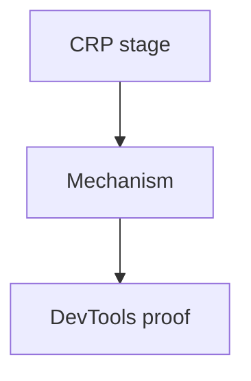
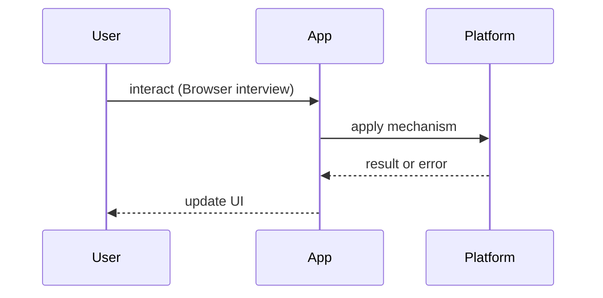

# Browser Interview Questions

<TopicMeta />

<Prerequisites />

::: tip Published
This page meets the handbook **published** bar: deep explanation, ≥10 common mistakes, and official references. Further engine-level errata welcome via PR.
:::

## Introduction

Question bank for **browser internals**. Canonical depth lives under [/03-browser/](/03-browser/). Keep answers pipeline-oriented: bytes → frames.

## Why does it exist?

Senior FE interviews stress rendering jank, caching, and the event loop. Framework answers without browser models stall at mid-level.

## Historical Background

Chrome’s multi-process architecture and CRP talks reshaped interview expectations beyond “DOM is a tree.”

## Mental Model

**Navigation → parse → style → layout → paint → composite**, concurrent with **JS task queues**. Point to the stage your answer lives in.

## Internal Workflow

**Q:** Critical rendering path stages?  
**A:** [/03-browser/critical-rendering-path/](/03-browser/critical-rendering-path/), DOM [/03-browser/dom/](/03-browser/dom/), CSSOM [/03-browser/cssom/](/03-browser/cssom/).

**Q:** Reflow vs repaint?  
**A:** [/03-browser/reflow/](/03-browser/reflow/), [/03-browser/repaint/](/03-browser/repaint/), composite [/03-browser/composite/](/03-browser/composite/).

**Q:** Event loop vs call stack?  
**A:** [/03-browser/call-stack/](/03-browser/call-stack/), [/03-browser/event-loop/](/03-browser/event-loop/), task queue [/03-browser/task-queue/](/03-browser/task-queue/).

**Q:** Why multi-process browsers?  
**A:** [/03-browser/multi-process-model/](/03-browser/multi-process-model/), architecture [/03-browser/browser-architecture/](/03-browser/browser-architecture/).

**Q:** How does V8 fit?  
**A:** [/03-browser/v8/](/03-browser/v8/), [/03-browser/javascript-engine/](/03-browser/javascript-engine/).

**Q:** What causes layout thrashing?  
**A:** Reading layout (offsetHeight) between writes — [/03-browser/layout/](/03-browser/layout/).

## Lifecycle

```mermaid
stateDiagram-v2
  [*] --> Parse
  Parse --> Style
  Style --> Layout
  Layout --> Paint
  Paint --> Composite
```

## Browser Perspective

Primary domain of this bank.

## JavaScript Engine Perspective

JS execution interrupts rendering.

## React Perspective

Commit → DOM mutations → style/layout.

## Next.js Perspective

SSR HTML still goes through CRP on the client.

## Server Perspective

TTFB feeds CRP start.

## Network Perspective

Preload scanner & waterfalls — [/04-html/preload/](/04-html/preload/).

## Memory Perspective

See [/03-browser/memory-management/](/03-browser/memory-management/).

## Performance

Tie answers to Performance panel: long tasks, layout shifts, layerization.

## Production Example

Drill with a slow page in DevTools: find forced sync layouts.

## Code Examples

```js
// Forced layout anti-pattern
for (const el of els) {
  el.style.width = el.offsetWidth + 1 + 'px' // read+write loop
}
```

## Diagrams





## Common Mistakes

1. Blaming React for pure layout thrash
2. Confusing paint with composite
3. No mention of main thread
4. Ignoring preload scanner
5. Mixing Node and browser event loops casually
6. Cannot explain GPU layers at a high level
7. Missing a production edge case for 24-interview-preparation.browser-interview-questions (#1)
8. Missing a production edge case for 24-interview-preparation.browser-interview-questions (#2)
9. Missing a production edge case for 24-interview-preparation.browser-interview-questions (#3)
10. Missing a production edge case for 24-interview-preparation.browser-interview-questions (#4)


## Best Practices

- Narrate stages in order
- Name the DevTools panel you’d open
- Link CSS containment/compositing topics when relevant

## Anti-patterns

- Only framework-centric answers to browser questions

## Comparison

| Symptom | Likely stage |
| --- | --- |
| FOUC | CSSOM late |
| Jank on scroll | Main thread / composite |
| Slow TTI | JS parse/exec |

## Interview Questions

### Easy

**Q:** What is the DOM?

**A:** Tree representation of the document — [/03-browser/dom/](/03-browser/dom/).

### Medium

**Q:** Difference between microtasks and macrotasks?

**A:** Microtasks ([/03-browser/microtasks/](/03-browser/microtasks/)) vs macrotasks ([/03-browser/macrotasks/](/03-browser/macrotasks/)) — promises vs timers/I/O tasks.

### Hard

**Q:** Walk through a click handler that reads layout and writes styles.

**A:** Event task → JS → possibly forced reflow → style/layout → paint/composite; discuss batching — [/03-browser/layout/](/03-browser/layout/).

## Summary

- Pipeline answers
- Link module 03 topics
- Prove with DevTools
- Separate engine vs rendering

## References

- [Chrome Developers — Rendering](https://developer.chrome.com/docs/performance/)
- [MDN — Critical rendering path](https://developer.mozilla.org/en-US/docs/Web/Performance/Critical_rendering_path)

<RelatedTopics />


Prev: [`24-interview-preparation.javascript-interview-questions`](/24-interview-preparation/javascript-interview-questions/) · Next: [`24-interview-preparation.react-interview-questions`](/24-interview-preparation/react-interview-questions/)
