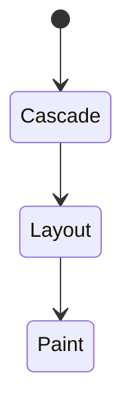
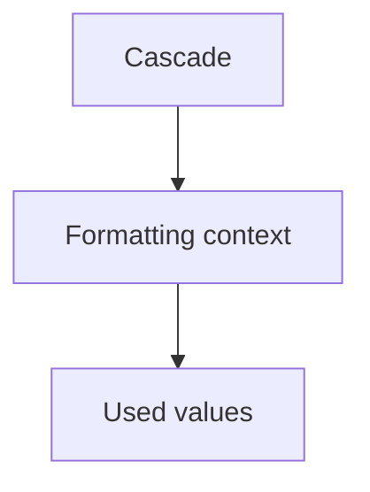
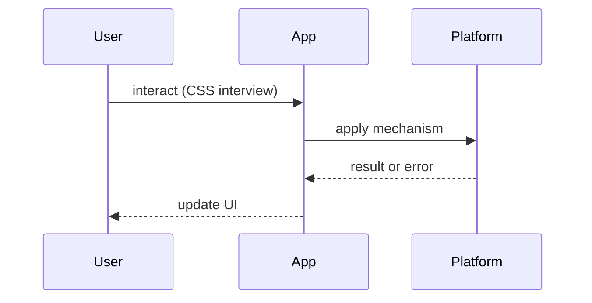

# CSS Interview Questions

<TopicMeta />

<Prerequisites />

::: tip Published
This page meets the handbook **published** bar: deep explanation, ≥10 common mistakes, and official references. Further engine-level errata welcome via PR.
:::

## Introduction

**CSS** question bank. Canonical pages: [/05-css/](/05-css/). Show you can reason about cascade and layout, not only framework classes.

## Why does it exist?

UI bugs are often cascade/specificity/containing-block issues mislabeled as React bugs.

## Historical Background

Floats → Flexbox/Grid → container queries/layers changed “modern CSS” interviews.

## Mental Model

**Cascade + inheritance + specificity → used value → box → formatting context (flow/flex/grid) → paint.**

## Internal Workflow

**Q:** Box model?  
**A:** [/05-css/box-model/](/05-css/box-model/).

**Q:** Specificity vs cascade vs layers?  
**A:** [/05-css/specificity/](/05-css/specificity/), [/05-css/cascade/](/05-css/cascade/), [/05-css/layers/](/05-css/layers/).

**Q:** Flex vs Grid?  
**A:** [/05-css/flexbox/](/05-css/flexbox/), [/05-css/grid/](/05-css/grid/).

**Q:** How does stacking/context work?  
**A:** Positioning [/05-css/positioning/](/05-css/positioning/) + compositing [/05-css/compositing/](/05-css/compositing/).

**Q:** Responsive strategy?  
**A:** [/05-css/responsive-design/](/05-css/responsive-design/), media [/05-css/media-queries/](/05-css/media-queries/), containers [/05-css/container-queries/](/05-css/container-queries/).

**Q:** Animation performance?  
**A:** Prefer transform/opacity — [/05-css/transforms/](/05-css/transforms/), [/05-css/animations/](/05-css/animations/).

## Lifecycle



## Browser Perspective

Style → layout → paint → composite.

## JavaScript Engine Perspective

Not applicable.

## React Perspective

ClassName composition; CSS-in-JS cost trade-offs.

## Next.js Perspective

CSS Modules/global order.

## Server Perspective

Not applicable.

## Network Perspective

CSS blocking rendering — CRP.

## Memory Perspective

Not applicable.

## Performance

Containment [/05-css/containment/](/05-css/containment/) for large trees.

## Production Example

Live debug a specificity fight with DevTools Styles pane.

## Code Examples

```css
.card { display: grid; gap: 1rem; }
@media (min-width: 768px) {
  .card { grid-template-columns: 1fr 1fr; }
}
```

## Diagrams





## Common Mistakes

1. !important as architecture
2. Absolute positioning spaghetti
3. Animating width/height causing layout
4. No stacking context mental model
5. Only Bootstrap trivia
6. Ignoring accessibility/contrast
7. Missing a production edge case for 24-interview-preparation.css-interview-questions (#1)
8. Missing a production edge case for 24-interview-preparation.css-interview-questions (#2)
9. Missing a production edge case for 24-interview-preparation.css-interview-questions (#3)
10. Missing a production edge case for 24-interview-preparation.css-interview-questions (#4)


## Best Practices

- Explain with DevTools computed styles
- Prefer logical properties for i18n
- Know when Grid wins

## Anti-patterns

- Pixel-perfect rigid layouts that ignore responsive

## Comparison

| Tool | Strength |
| --- | --- |
| Flex | 1D alignment |
| Grid | 2D layout |
| Absolute | Escapes flow (sparingly) |

## Interview Questions

### Easy

**Q:** What does box-sizing: border-box do?

**A:** Width includes padding/border — [/05-css/box-model/](/05-css/box-model/).

### Medium

**Q:** How do you center a div?

**A:** Multiple valid answers (flex/grid); discuss containing block — prefer modern layout modules.

### Hard

**Q:** Debug an element appearing under an overlay unexpectedly.

**A:** Stacking contexts, z-index, transforms creating contexts — [/05-css/positioning/](/05-css/positioning/), compositing topic.

## Summary

- Cascade + layout models
- Link module 05
- Perf via composite-friendly anim
- DevTools fluency

## References

- [MDN CSS](https://developer.mozilla.org/en-US/docs/Web/CSS)
- [CSS Specifications — W3C/WHATWG](https://www.w3.org/Style/CSS/)

<RelatedTopics />


Prev: [`24-interview-preparation.network-interview-questions`](/24-interview-preparation/network-interview-questions/) · Next: [`24-interview-preparation.typescript-interview-questions`](/24-interview-preparation/typescript-interview-questions/)
