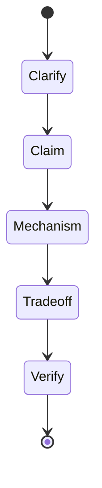
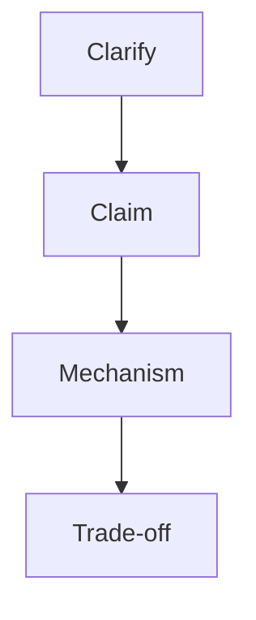
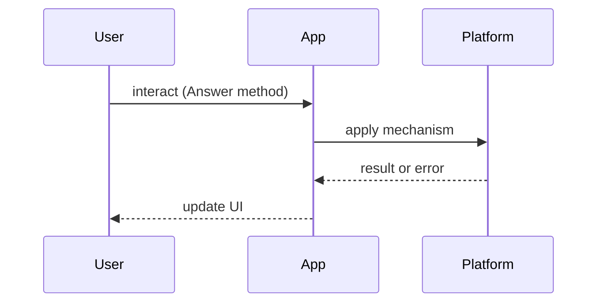

# How to Answer

<TopicMeta />

<Prerequisites />

::: tip Published
This page meets the handbook **published** bar: deep explanation, ≥10 common mistakes, and official references. Further engine-level errata welcome via PR.
:::

## Introduction

**How to Answer** is the meta-skill for this module. Strong candidates do not recite blogs — they derive answers from mental models and point to concrete mechanisms (event loop, rendering, HTTP, React commit).

Use sibling question banks for drills; use this page for the answering framework.

## Why does it exist?

Interviews reward clarity under time pressure. Without a structure, people ramble, skip trade-offs, or invent APIs. A method keeps answers falsifiable and depth-calibrated.

## Historical Background

Classic advice (STAR for behavioral, “communicate while coding”) adapted poorly to systems/frontend unless paired with browser/network models. This handbook treats interview prep as navigation across canonical topics.

## Mental Model

**CLAIM → MECHANISM → TRADE-OFF → VERIFY**:

1. One-sentence claim  
2. Mechanism (what the browser/engine/framework does)  
3. Trade-off / failure mode  
4. How you’d verify (DevTools, metric, test)

Map each claim to a handbook path when studying.

## Internal Workflow

1. Clarify scope (“browser event loop or Node?”)

2. Give the claim in ≤2 sentences

3. Walk one happy-path pipeline

4. Name one failure mode

5. Offer a measurement or experiment

6. Stop — invite follow-ups

### Mini drill

**Q:** What happens when you type a URL and press Enter?

**A skeleton:** DNS → TCP/TLS → HTTP → parse HTML → preload scanner → CSSOM/DOM → render tree → layout → paint → composite; JS via event loop. Deep links: [/02-internet/dns/](/02-internet/dns/), [/03-browser/critical-rendering-path/](/03-browser/critical-rendering-path/), [/03-browser/event-loop/](/03-browser/event-loop/).

## Lifecycle



## Browser Perspective

Prefer answers that name observable DevTools panels.

## JavaScript Engine Perspective

Separate language semantics from engine optimizations.

## React Perspective

Distinguish render, commit, and effects.

## Next.js Perspective

Always ask server vs client runtime.

## Server Perspective

Mention TTFB/caching when relevant.

## Network Perspective

Latency vs bandwidth vs failure modes.

## Memory Perspective

Leaks = retained references; say how you’d confirm.

## Performance

Timebox: 60–90s for easy, 3–5 minutes for medium design answers.

## Production Example

In mock interviews, graders score: correctness, structure, trade-offs, and whether you invent vs admit uncertainty.

## Code Examples

```text
Template card:
Q: …
Claim:
Mechanism:
Trade-off:
Verify:
Links: /module/topic/
```

## Diagrams





## Common Mistakes

1. Memorizing answers without mechanisms
2. Buzzwords without definitions
3. Ignoring failure modes
4. Never mentioning how to measure
5. Talking past the question
6. Pretending certainty instead of scoping assumptions
7. Missing a production edge case for 24-interview-preparation.how-to-answer (#1)
8. Missing a production edge case for 24-interview-preparation.how-to-answer (#2)
9. Missing a production edge case for 24-interview-preparation.how-to-answer (#3)
10. Missing a production edge case for 24-interview-preparation.how-to-answer (#4)


## Best Practices

- Practice aloud with a timer
- Link every drill to a handbook topic
- Keep a personal “wrong answers” list
- Prefer diagrams for system design

## Anti-patterns

- Resume keyword salad
- Framework fanboyism without platform knowledge

## Comparison

| Style | Signal |
| --- | --- |
| Recitation | Weak |
| Structured mechanism | Strong |
| Trade-off + verify | Strongest |

## Interview Questions

### Easy

**Q:** How should you start any technical interview answer?

**A:** Clarify the environment and restate the question as a one-line claim before diving deep.

### Medium

**Q:** How do you show seniority without over-talking?

**A:** Lead with the model, give one concrete path, name a trade-off, and stop for questions — depth on demand.

### Hard

**Q:** You don’t know an API detail — what do you do?

**A:** Say what you know, state the invariant you’d check in docs/DevTools, and reason from adjacent fundamentals (e.g. HTTP caching) instead of fabricating.

## Summary

- Claim → mechanism → trade-off → verify
- Link study to canonical topics
- Timebox and invite follow-ups
- Admit uncertainty cleanly

## References

- [React docs — Learn](https://react.dev/learn)
- [MDN Web Docs](https://developer.mozilla.org/)
- [web.dev](https://web.dev/)

<RelatedTopics />


Next: [`24-interview-preparation.javascript-interview-questions`](/24-interview-preparation/javascript-interview-questions/)
