# Interview Preparation

## Scope

Question banks with deep answers linked to canonical topics

## Prerequisites

See the learning paths and each topic's prerequisites in the registry.

## Topics in order

- [How to Answer](/24-interview-preparation/how-to-answer/) — junior, ~20 min
- [JavaScript Interview Questions](/24-interview-preparation/javascript-interview-questions/) — mid, ~60 min
- [Browser Interview Questions](/24-interview-preparation/browser-interview-questions/) — mid, ~60 min
- [React Interview Questions](/24-interview-preparation/react-interview-questions/) — mid, ~60 min
- [Next.js Interview Questions](/24-interview-preparation/nextjs-interview-questions/) — mid, ~45 min
- [Network Interview Questions](/24-interview-preparation/network-interview-questions/) — mid, ~45 min
- [CSS Interview Questions](/24-interview-preparation/css-interview-questions/) — mid, ~45 min
- [TypeScript Interview Questions](/24-interview-preparation/typescript-interview-questions/) — mid, ~45 min
- [Performance Interview Questions](/24-interview-preparation/performance-interview-questions/) — mid, ~45 min
- [Security Interview Questions](/24-interview-preparation/security-interview-questions/) — mid, ~40 min
- [System Design Interview Questions](/24-interview-preparation/system-design-interview-questions/) — senior, ~60 min

## Module knowledge graph

```mermaid
flowchart TD
  moduleNode[24_interview_preparation]
  moduleNode --> how_to_answer
  moduleNode --> javascript_interview_questions
  moduleNode --> browser_interview_questions
  moduleNode --> react_interview_questions
  moduleNode --> nextjs_interview_questions
  moduleNode --> network_interview_questions
  moduleNode --> css_interview_questions
  moduleNode --> typescript_interview_questions
  moduleNode --> performance_interview_questions
  moduleNode --> security_interview_questions
  moduleNode --> system_design_interview_questions
```

## Suggested learning paths

Browse [Learning Paths](/learning-paths/).
