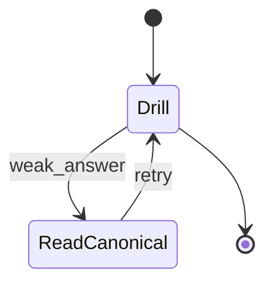
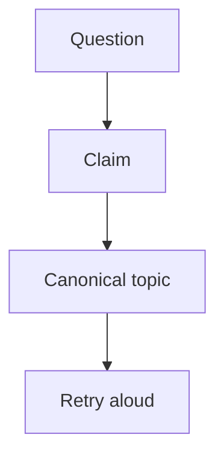
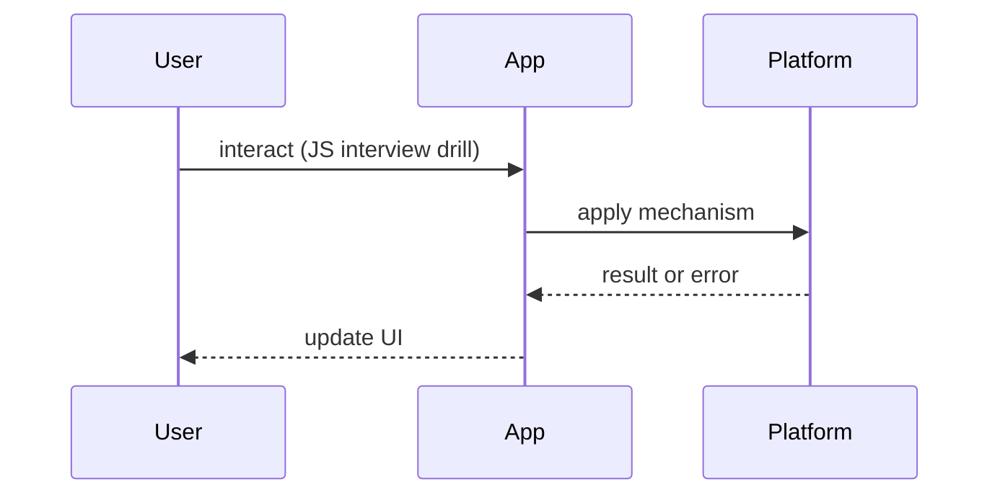

# JavaScript Interview Questions

<TopicMeta />

<Prerequisites />

::: tip Published
This page meets the handbook **published** bar: deep explanation, ≥10 common mistakes, and official references. Further engine-level errata welcome via PR.
:::

## Introduction

This page is a **question bank**, not a second JavaScript course. Answers are short and point to canonical topics under [/06-javascript/](/06-javascript/). Study those pages for depth; use this page for drills.

## Why does it exist?

JS interviews probe mental models (scope, this, event loop, promises). Linking answers prevents shallow memorization.

## Historical Background

Frontend interviews standardized around ES6+ language semantics, async models, and browser-hosted JS quirks.

## Mental Model

For each question: identify whether it is **language semantics**, **runtime/event loop**, or **API**. Route to the matching handbook chapter.

## Internal Workflow

### Easy bank

**Q:** Difference between `let`, `const`, `var`?  
**A:** Scope + TDZ + redeclaration rules — [/06-javascript/variables/](/06-javascript/variables/), [/06-javascript/hoisting/](/06-javascript/hoisting/).

**Q:** What is a closure?  
**A:** Function + retained lexical environment — [/06-javascript/closures/](/06-javascript/closures/).

**Q:** `==` vs `===`?  
**A:** Coercion vs strict equality — [/06-javascript/types-and-values/](/06-javascript/types-and-values/).

### Medium bank

**Q:** Explain the event loop, microtasks, macrotasks.  
**A:** [/03-browser/event-loop/](/03-browser/event-loop/), [/06-javascript/event-loop-js/](/06-javascript/event-loop-js/), [/03-browser/microtasks/](/03-browser/microtasks/).

**Q:** How does `this` work in arrow vs function?  
**A:** [/06-javascript/this/](/06-javascript/this/), [/06-javascript/functions/](/06-javascript/functions/).

**Q:** Promise vs async/await pitfalls?  
**A:** [/06-javascript/promise/](/06-javascript/promise/), [/06-javascript/async-await/](/06-javascript/async-await/), error handling [/06-javascript/error-handling/](/06-javascript/error-handling/).

### Hard bank

**Q:** Implement a cancellable fetch pattern.  
**A:** AbortController — [/06-javascript/abortcontroller/](/06-javascript/abortcontroller/), [/06-javascript/fetch-api/](/06-javascript/fetch-api/).

**Q:** How do generators/iterators enable lazy sequences?  
**A:** [/06-javascript/generator/](/06-javascript/generator/), [/06-javascript/iterator/](/06-javascript/iterator/).

**Q:** Prototype chain vs class syntax?  
**A:** [/06-javascript/prototype/](/06-javascript/prototype/), [/06-javascript/prototype-chain/](/06-javascript/prototype-chain/), [/06-javascript/classes/](/06-javascript/classes/).

## Lifecycle



## Browser Perspective

Many JS questions are really browser runtime questions — bridge to module 03.

## JavaScript Engine Perspective

Hidden classes/IC are bonus depth, not required for most mid interviews.

## React Perspective

Stale closures in hooks are applied closure questions — [/10-react/hooks/](/10-react/hooks/).

## Next.js Perspective

Same JS, different globals (no DOM on server).

## Server Perspective

Node event loop similarities/differences.

## Network Perspective

fetch/AbortController sit on network boundaries.

## Memory Perspective

Closures retaining DOM nodes — [/06-javascript/memory-and-references/](/06-javascript/memory-and-references/).

## Performance

Interview tip: mention algorithmic cost when manipulating large arrays — [/06-javascript/arrays/](/06-javascript/arrays/).

## Production Example

Mock format: 45 minutes, 6–8 questions mixed easy/medium, one coding async exercise with AbortController.

## Code Examples

```js
// Classic drill: what logs and why?
for (var i = 0; i < 3; i++) setTimeout(() => console.log(i), 0)
// → 3,3,3 — var function scope; fix with let or binding
// See /06-javascript/closures/ and /06-javascript/variables/
```

## Diagrams





## Common Mistakes

1. Reciting “closure is a function inside a function” only
2. Confusing event loop with React rendering
3. Claiming async/await blocks the main thread
4. Ignoring coercion edge cases
5. Cannot explain Promise states
6. No mental model for prototypal inheritance
7. Missing a production edge case for 24-interview-preparation.javascript-interview-questions (#1)
8. Missing a production edge case for 24-interview-preparation.javascript-interview-questions (#2)
9. Missing a production edge case for 24-interview-preparation.javascript-interview-questions (#3)
10. Missing a production edge case for 24-interview-preparation.javascript-interview-questions (#4)


## Best Practices

- Always cite the mechanism
- Draw microtask vs macrotask queues
- Code small demos locally
- Cross-link browser topics

## Anti-patterns

- Only grinding trivia flashcards

## Comparison

| Topic cluster | Start here |
| --- | --- |
| Scope/closures | /06-javascript/closures/ |
| Async | /06-javascript/promise/ |
| Objects | /06-javascript/prototype-chain/ |

## Interview Questions

### Easy

**Q:** What is hoisting?

**A:** Declaration binding behavior before evaluation — details and TDZ in [/06-javascript/hoisting/](/06-javascript/hoisting/).

### Medium

**Q:** Why does `const obj = {}; obj.x = 1` work?

**A:** `const` prevents rebinding, not mutation of the object value — [/06-javascript/variables/](/06-javascript/variables/), [/06-javascript/objects/](/06-javascript/objects/).

### Hard

**Q:** Explain Promise constructor executor vs microtask scheduling of `then`.

**A:** Executor runs sync; handlers queue as microtasks — [/06-javascript/promise/](/06-javascript/promise/), [/03-browser/microtasks/](/03-browser/microtasks/).

## Summary

- Bank + canonical links
- Language vs runtime vs API
- Practice aloud with demos
- Bridge to browser module

## References

- [ECMAScript specification](https://tc39.es/ecma262/)
- [MDN JavaScript](https://developer.mozilla.org/en-US/docs/Web/JavaScript)

<RelatedTopics />


Prev: [`24-interview-preparation.how-to-answer`](/24-interview-preparation/how-to-answer/) · Next: [`24-interview-preparation.browser-interview-questions`](/24-interview-preparation/browser-interview-questions/)
