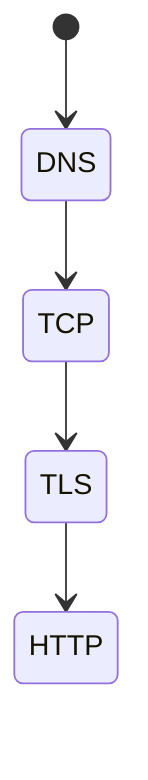
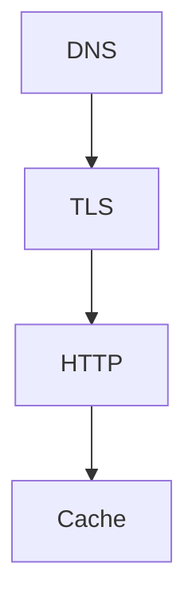
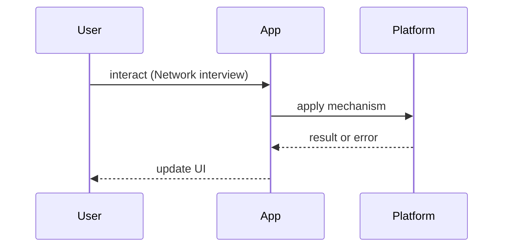

# Network Interview Questions

<TopicMeta />

<Prerequisites />

::: tip Published
This page meets the handbook **published** bar: deep explanation, ≥10 common mistakes, and official references. Further engine-level errata welcome via PR.
:::

## Introduction

**Network** question bank. Canonical topics under [/02-internet/](/02-internet/). Narrate layers; avoid hand-wavy “just REST.”

## Why does it exist?

Frontend performance and security bugs are often network misconceptions (cookies, CORS, caching).

## Historical Background

HTTP/1.1 → HTTP/2 multiplexing → QUIC/HTTP/3 changed performance answers.

## Mental Model

**DNS → TCP/TLS → HTTP → app**. Caching and auth sit across layers.

## Internal Workflow

**Q:** What happens after entering a URL?  
**A:** [/02-internet/dns/](/02-internet/dns/), [/02-internet/tcp/](/02-internet/tcp/), [/02-internet/tls/](/02-internet/tls/), [/02-internet/http/](/02-internet/http/).

**Q:** HTTP caching headers?  
**A:** [/02-internet/http-caching/](/02-internet/http-caching/).

**Q:** Cookies vs localStorage for tokens?  
**A:** [/02-internet/cookies/](/02-internet/cookies/), security module — HttpOnly/Secure/SameSite.

**Q:** CORS why?  
**A:** Browser SOP; server opts in — security topics + HTTP.

**Q:** HTTP/2 vs HTTP/3?  
**A:** [/02-internet/http2/](/02-internet/http2/), [/02-internet/http3/](/02-internet/http3/), [/02-internet/quic/](/02-internet/quic/).

**Q:** WebSocket vs SSE?  
**A:** [/02-internet/websocket/](/02-internet/websocket/), [/02-internet/sse/](/02-internet/sse/).

## Lifecycle



## Browser Perspective

Enforces CORS, mixed content, cookie policies.

## JavaScript Engine Perspective

Not applicable.

## React Perspective

Not applicable.

## Next.js Perspective

CDN/cache interplay.

## Server Perspective

Headers are contracts.

## Network Perspective

Primary domain.

## Memory Perspective

Not applicable.

## Performance

Waterfalls, connection reuse, RTT dominance on mobile.

## Production Example

Read a HAR file together in mock interviews.

## Code Examples

```http
GET /app.js HTTP/1.1
If-None-Match: "abc"
```

## Diagrams





## Common Mistakes

1. Forgetting DNS/TLS time in “page load”
2. Caching private responses publicly
3. Explaining CORS as a server firewall
4. WebSockets without reconnect story
5. Confusing authentication with authorization
6. Ignoring SameSite cookie changes
7. Missing a production edge case for 24-interview-preparation.network-interview-questions (#1)
8. Missing a production edge case for 24-interview-preparation.network-interview-questions (#2)
9. Missing a production edge case for 24-interview-preparation.network-interview-questions (#3)
10. Missing a production edge case for 24-interview-preparation.network-interview-questions (#4)


## Best Practices

- Layered narration
- Mention mobile RTTs
- Point to RFCs/MDN when precise

## Anti-patterns

- Only axios trivia

## Comparison

| API style | Handbook |
| --- | --- |
| REST | /02-internet/rest/ |
| GraphQL | /02-internet/graphql/ |
| Realtime | /02-internet/websocket/ |

## Interview Questions

### Easy

**Q:** What does HTTPS add over HTTP?

**A:** TLS confidentiality/integrity/auth — [/02-internet/https/](/02-internet/https/), [/02-internet/tls/](/02-internet/tls/).

### Medium

**Q:** Explain ETag revalidation.

**A:** Conditional requests with If-None-Match → 304 — [/02-internet/http-caching/](/02-internet/http-caching/).

### Hard

**Q:** Design auth for SPA + API on different subdomains.

**A:** Cookie SameSite/domain carefully or bearer tokens with XSS considerations; CSRF if cookies — link cookies/sessions/security topics.

## Summary

- Layered network answers
- Cache and cookies are FE topics
- Link module 02
- Use HAR/DevTools in drills

## References

- [MDN — HTTP](https://developer.mozilla.org/en-US/docs/Web/HTTP)
- [RFC 9110](https://www.rfc-editor.org/rfc/rfc9110)

<RelatedTopics />


Prev: [`24-interview-preparation.nextjs-interview-questions`](/24-interview-preparation/nextjs-interview-questions/) · Next: [`24-interview-preparation.css-interview-questions`](/24-interview-preparation/css-interview-questions/)
