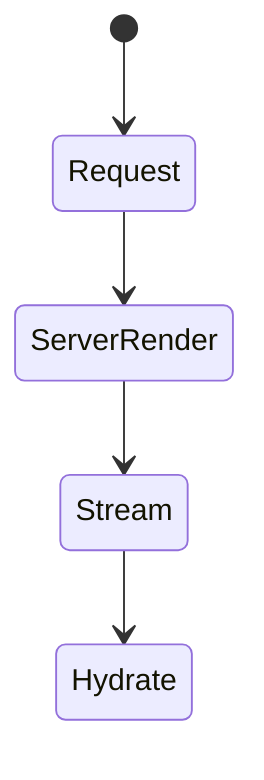
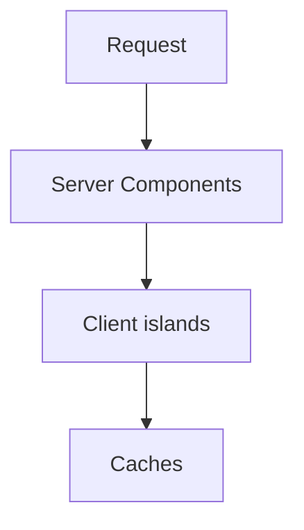
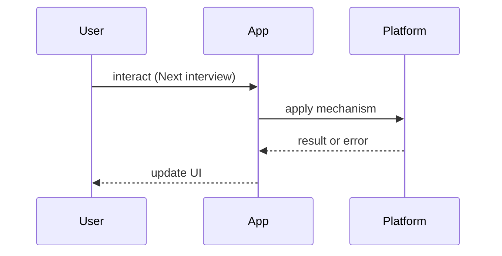

# Next.js Interview Questions

<TopicMeta />

<Prerequisites />

::: tip Published
This page meets the handbook **published** bar: deep explanation, ≥10 common mistakes, and official references. Further engine-level errata welcome via PR.
:::

## Introduction

**Next.js** question bank. Prefer official model terms (Full Route Cache, Data Cache, Router Cache). Depth: [/11-nextjs/](/11-nextjs/), rendering [/12-rendering/](/12-rendering/).

## Why does it exist?

Next interviews fail candidates who treat it as “React with folders” and mishandle caching/RSC.

## Historical Background

Pages Router → App Router + RSC changed the default interview surface.

## Mental Model

Ask: **Where does this code run?** Server Component, Client Component, Route Handler, Edge, or build time?

## Internal Workflow

**Q:** RSC vs Client Components?  
**A:** [/11-nextjs/server-components/](/11-nextjs/server-components/), [/10-react/server-components-overview/](/10-react/server-components-overview/); client interactivity leaves.

**Q:** SSR vs SSG vs ISR?  
**A:** [/12-rendering/ssr/](/12-rendering/ssr/), [/12-rendering/ssg/](/12-rendering/ssg/), [/12-rendering/isr/](/12-rendering/isr/).

**Q:** What caches exist in App Router?  
**A:** Distinguish route/data/router caches — Next docs; handbook caching [/21-frontend-system-design/caching-strategies/](/21-frontend-system-design/caching-strategies/).

**Q:** When `"use client"`?  
**A:** Hooks, state, browser APIs — push it down the tree.

**Q:** Streaming/Suspense benefits?  
**A:** [/12-rendering/streaming/](/12-rendering/streaming/).

**Q:** Middleware use cases/risks?  
**A:** Auth gating, rewrites; keep light — Edge constraints.

## Lifecycle



## Browser Perspective

Hydration attaches to SSR HTML.

## JavaScript Engine Perspective

Not applicable.

## React Perspective

RSC payload + client bundles cooperate.

## Next.js Perspective

Primary domain.

## Server Perspective

TTFB, dynamic vs static.

## Network Perspective

CDN caching of RSC/HTML.

## Memory Perspective

Not applicable.

## Performance

Waterfalls in nested server fetches; bundle of client islands.

## Production Example

Case study: slow TTFB from dynamic rendering forced by cookies — discuss static shells + client personalization.

## Code Examples

```tsx
// Interview drill: why is this a client boundary problem?
'use client'
import HeavyChart from './HeavyChart'
export default function Page() {
  return <HeavyChart /> // entire page becomes client if this is the page module
}
```

## Diagrams





## Common Mistakes

1. Marking whole trees client unnecessarily
2. Treating all caches as one
3. Fetching secrets into client bundles
4. Ignoring hydration mismatches
5. SSR “for SEO” without measuring
6. Blocking middleware doing heavy work
7. Missing a production edge case for 24-interview-preparation.nextjs-interview-questions (#1)
8. Missing a production edge case for 24-interview-preparation.nextjs-interview-questions (#2)
9. Missing a production edge case for 24-interview-preparation.nextjs-interview-questions (#3)
10. Missing a production edge case for 24-interview-preparation.nextjs-interview-questions (#4)


## Best Practices

- Server by default
- Push client leaves down
- Name which cache layer
- Measure TTFB + hydration

## Anti-patterns

- next/image folklore without CLS understanding

## Comparison

| Mode | Freshness | Cost |
| --- | --- | --- |
| Static | Build-time | Lowest runtime |
| Dynamic SSR | Per request | Higher |
| Streaming RSC | Progressive | Medium |

## Interview Questions

### Easy

**Q:** What is the App Router?

**A:** Filesystem routing with layouts/templates and Server Components by default — see Next docs / module 11 topics.

### Medium

**Q:** How can cookies opt a route into dynamic rendering?

**A:** Reading dynamic data APIs signals dynamic behavior; explain caching implications honestly.

### Hard

**Q:** Design a product page with static shell and personalized cart.

**A:** Static/RSC product data cached; cart as client island fetching private API; avoid caching personalized HTML publicly.

## Summary

- Where does code run?
- Name cache layers
- Server default, client leaves
- Link rendering module

## References

- [Next.js Documentation](https://nextjs.org/docs)
- [React Server Components](https://react.dev/reference/rsc/server-components)

<RelatedTopics />


Prev: [`24-interview-preparation.react-interview-questions`](/24-interview-preparation/react-interview-questions/) · Next: [`24-interview-preparation.network-interview-questions`](/24-interview-preparation/network-interview-questions/)
