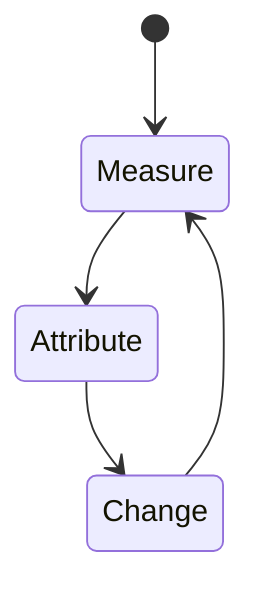
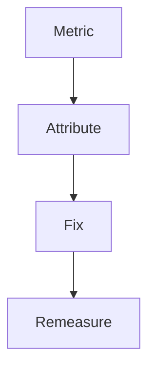
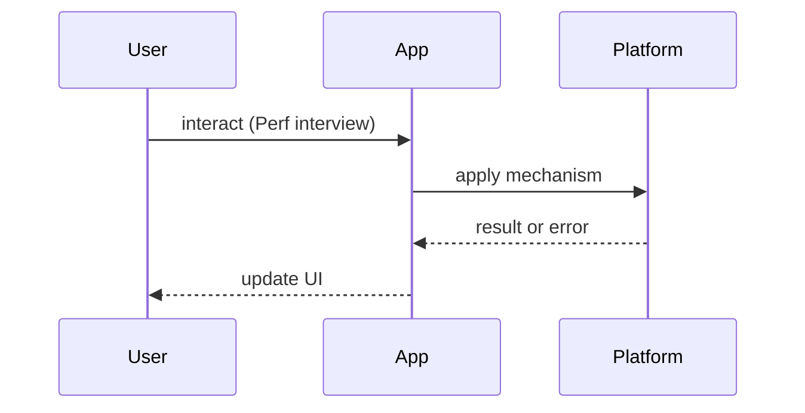

# Performance Interview Questions

<TopicMeta />

<Prerequisites />

::: tip Published
This page meets the handbook **published** bar: deep explanation, ≥10 common mistakes, and official references. Further engine-level errata welcome via PR.
:::

## Introduction

**Performance** question bank. Depth: [/13-performance/](/13-performance/), CRP [/03-browser/critical-rendering-path/](/03-browser/critical-rendering-path/). Always pair advice with a metric.

## Why does it exist?

“Make it faster” without metrics is folklore. Interviews want measurement literacy.

## Historical Background

PageSpeed → RAIL → Core Web Vitals (LCP, INP, CLS) shifted the vocabulary.

## Mental Model

**Measure → attribute → change one variable → remeasure.** Lab vs field (RUM).

## Internal Workflow

**Q:** What are Core Web Vitals?  
**A:** LCP/INP/CLS — web.dev + [/13-performance/](/13-performance/) topics.

**Q:** How to improve LCP?  
**A:** Server TTFB, hero image priorities, avoid blocking CSS/JS — preload [/04-html/preload/](/04-html/preload/).

**Q:** What causes CLS?  
**A:** Untyped images/ads/fonts — reserve space.

**Q:** Long tasks?  
**A:** Break up JS; workers [/09-browser-apis/web-workers/](/09-browser-apis/web-workers/).

**Q:** React list jank?  
**A:** Virtualize; state locality — [/21-frontend-system-design/infinite-scroll/](/21-frontend-system-design/infinite-scroll/).

**Q:** Caching impact?  
**A:** [/02-internet/http-caching/](/02-internet/http-caching/), [/21-frontend-system-design/caching-strategies/](/21-frontend-system-design/caching-strategies/).

## Lifecycle



## Browser Perspective

Performance panel, Lighthouse, Web Vitals.

## JavaScript Engine Perspective

Parse/compile/GC.

## React Perspective

Profiler commit times.

## Next.js Perspective

Bundles, streaming, server timings.

## Server Perspective

TTFB.

## Network Perspective

Waterfalls.

## Memory Perspective

Heap snapshots.

## Performance

This whole page is about performance literacy.

## Production Example

Ask for a before/after metric story from the candidate’s experience.

## Code Examples

```js
performance.getEntriesByType('navigation')
// discuss TTFB, DOMContentLoaded, load
```

## Diagrams





## Common Mistakes

1. Optimizing without metrics
2. Chasing Lighthouse score hacks
3. Ignoring field data
4. Micro-memoization vs network waterfalls
5. Huge images “compressed” as PNG screenshots
6. Hydration cost ignored in SSR apps
7. Missing a production edge case for 24-interview-preparation.performance-interview-questions (#1)
8. Missing a production edge case for 24-interview-preparation.performance-interview-questions (#2)
9. Missing a production edge case for 24-interview-preparation.performance-interview-questions (#3)
10. Missing a production edge case for 24-interview-preparation.performance-interview-questions (#4)


## Best Practices

- Name the vital
- Lab + RUM
- Budgets in CI

## Anti-patterns

- Premature Web Workers for tiny work

## Comparison

| Metric | User pain |
| --- | --- |
| LCP | Slow hero |
| INP | Sluggish clicks |
| CLS | Jumping layout |

## Interview Questions

### Easy

**Q:** What is LCP?

**A:** Largest Contentful Paint — when the main content likely appeared. See web.dev / performance module.

### Medium

**Q:** How do you find the cause of poor INP?

**A:** Performance panel: long tasks, forced layouts, expensive handlers; optimize input path.

### Hard

**Q:** Design a performance budget for a Next.js marketing site.

**A:** Budgets for JS KB, LCP, image weights; CI fail; RUM dashboards; caching strategy for static assets.

## Summary

- Metrics first
- Attribute precisely
- Link CRP + performance modules
- Lab and field

## References

- [web.dev — Vitals](https://web.dev/vitals/)
- [Chrome — Performance](https://developer.chrome.com/docs/performance/)

<RelatedTopics />


Prev: [`24-interview-preparation.typescript-interview-questions`](/24-interview-preparation/typescript-interview-questions/) · Next: [`24-interview-preparation.security-interview-questions`](/24-interview-preparation/security-interview-questions/)
