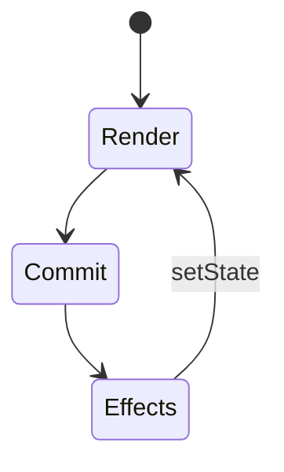
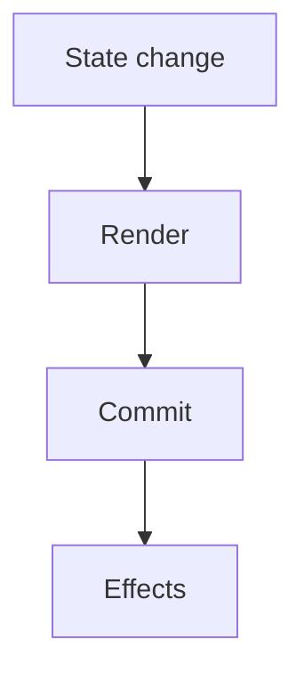
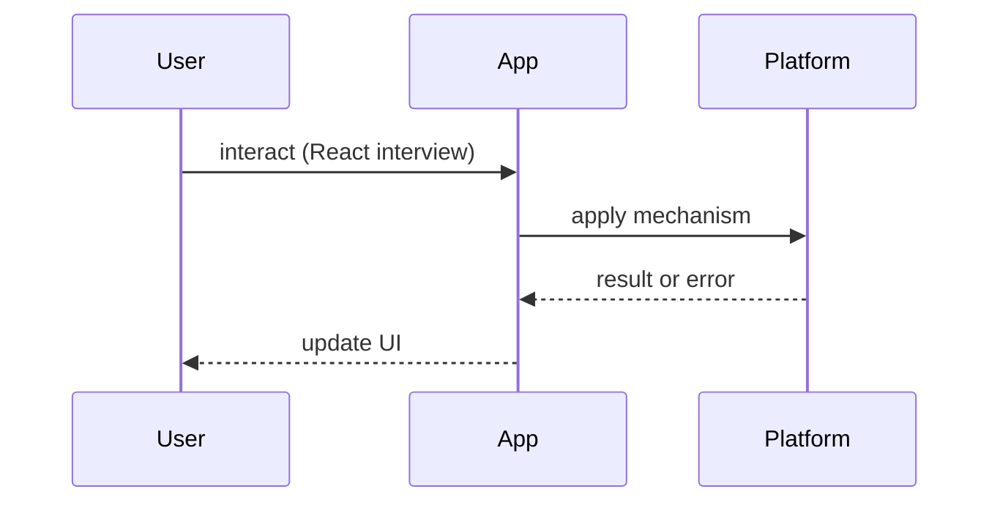

# React Interview Questions

<TopicMeta />

<Prerequisites />

::: tip Published
This page meets the handbook **published** bar: deep explanation, ≥10 common mistakes, and official references. Further engine-level errata welcome via PR.
:::

## Introduction

**React** question bank. Depth pages live under [/10-react/](/10-react/) and [/08-jsx-and-react-runtime/](/08-jsx-and-react-runtime/). Prefer trade-offs over slogans.

## Why does it exist?

React interviews test whether you understand rendering as a function of state, effects as escape hatches, and reconciliation costs.

## Historical Background

Class era → hooks → concurrent features → Server Components shifted questions toward boundaries and data ownership.

## Mental Model

**State → render → reconcile → commit → effects**. Place every answer on that timeline.

## Internal Workflow

**Q:** Why keys in lists?  
**A:** [/08-jsx-and-react-runtime/keys/](/08-jsx-and-react-runtime/keys/), reconciliation [/08-jsx-and-react-runtime/reconciliation/](/08-jsx-and-react-runtime/reconciliation/).

**Q:** useEffect vs event handler?  
**A:** [/10-react/effects-vs-events/](/10-react/effects-vs-events/), [/10-react/useeffect/](/10-react/useeffect/).

**Q:** useMemo/useCallback — when?  
**A:** [/10-react/memoization/](/10-react/memoization/), [/10-react/react-memo/](/10-react/react-memo/) — measure first.

**Q:** What is reconciliation/Fiber?  
**A:** [/08-jsx-and-react-runtime/fiber/](/08-jsx-and-react-runtime/fiber/), [/08-jsx-and-react-runtime/virtual-dom/](/08-jsx-and-react-runtime/virtual-dom/).

**Q:** Context pitfalls?  
**A:** [/10-react/context/](/10-react/context/) — update frequency & provider value identity.

**Q:** Concurrent features?  
**A:** [/10-react/concurrent-rendering/](/10-react/concurrent-rendering/), deferred values [/10-react/deferred-value/](/10-react/deferred-value/).

**Q:** Error boundaries?  
**A:** [/10-react/error-boundaries/](/10-react/error-boundaries/).

## Lifecycle



## Browser Perspective

Commit mutates DOM → browser style/layout.

## JavaScript Engine Perspective

Render work is JS on the main thread.

## React Perspective

Primary domain.

## Next.js Perspective

RSC changes where components run — [/11-nextjs/](/11-nextjs/).

## Server Perspective

RSC data access.

## Network Perspective

Data libraries & cache invalidation.

## Memory Perspective

Stale closures retaining large structures.

## Performance

Profiler + why-did-you-render style reasoning; INP for interactions.

## Production Example

Ask candidates to redesign a slow list: keys, virtualization, state locality.

## Code Examples

```tsx
// Stale closure drill
useEffect(() => {
  const id = setInterval(() => console.log(count), 1000)
  return () => clearInterval(id)
}, []) // missing count — explain & fix
```

## Diagrams





## Common Mistakes

1. Derived state in effects by default
2. Index keys on reorderable lists
3. Mega context for high-frequency state
4. Memo everywhere without evidence
5. Fetching in effects without cleanup/abort
6. Cannot explain Strict Mode double effects in dev
7. Missing a production edge case for 24-interview-preparation.react-interview-questions (#1)
8. Missing a production edge case for 24-interview-preparation.react-interview-questions (#2)
9. Missing a production edge case for 24-interview-preparation.react-interview-questions (#3)
10. Missing a production edge case for 24-interview-preparation.react-interview-questions (#4)


## Best Practices

- Timeline narration
- Link to react.dev mental models
- Discuss server/client boundaries when relevant

## Anti-patterns

- Class-component trivia as a substitute for modern understanding

## Comparison

| Question type | Link |
| --- | --- |
| Hooks rules | /10-react/hooks/ |
| Perf | /10-react/memoization/ |
| Runtime | /08-jsx-and-react-runtime/fiber/ |

## Interview Questions

### Easy

**Q:** What is JSX?

**A:** Syntax transforming to elements — [/08-jsx-and-react-runtime/jsx/](/08-jsx-and-react-runtime/jsx/).

### Medium

**Q:** How does React decide what to update?

**A:** Reconcile by type/position/keys — [/08-jsx-and-react-runtime/diffing-algorithm/](/08-jsx-and-react-runtime/diffing-algorithm/).

### Hard

**Q:** Design data flow for a dashboard with live updates and filters.

**A:** URL for filters, external store or query cache for server data, concurrent features for typing — link [/15-architecture/state-management/](/15-architecture/state-management/) + realtime topics.

## Summary

- Render timeline answers
- Link 08 + 10 topics
- Trade-offs > trivia
- Effects are escape hatches

## References

- [React Documentation](https://react.dev/)
- [React Reference](https://react.dev/reference/react)

<RelatedTopics />


Prev: [`24-interview-preparation.browser-interview-questions`](/24-interview-preparation/browser-interview-questions/) · Next: [`24-interview-preparation.nextjs-interview-questions`](/24-interview-preparation/nextjs-interview-questions/)
