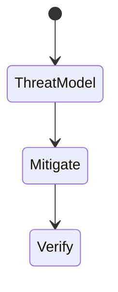
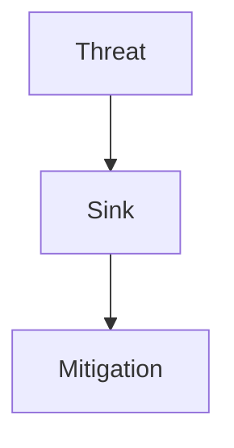
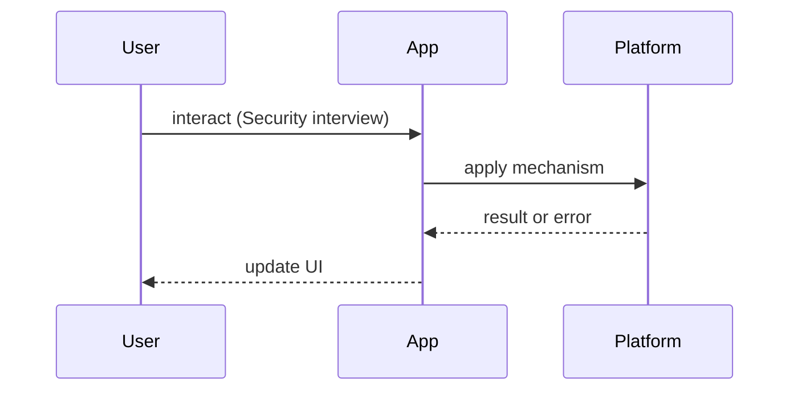

# Security Interview Questions

<TopicMeta />

<Prerequisites />

::: tip Published
This page meets the handbook **published** bar: deep explanation, ≥10 common mistakes, and official references. Further engine-level errata welcome via PR.
:::

## Introduction

**Security** question bank for frontend engineers. Canonical: [/17-security/](/17-security/), cookies [/02-internet/cookies/](/02-internet/cookies/). Never treat client checks as authorization.

## Why does it exist?

XSS/CSRF/token storage mistakes are common FE vulnerabilities.

## Historical Background

XSS remains top web risk; SameSite cookies and CSP evolved browser defenses.

## Mental Model

**Threat → sink → defense**. E.g. attacker-controlled string → `innerHTML` → XSS; defense encode + CSP.

## Internal Workflow

**Q:** What is XSS?  
**A:** Injecting script into pages — OWASP + handbook security XSS topic.

**Q:** CSRF?  
**A:** Cross-site requests with cookies — SameSite, CSRF tokens.

**Q:** Where to store tokens?  
**A:** Prefer HttpOnly cookies with CSRF strategy; localStorage is XSS-sensitive.

**Q:** CSP purpose?  
**A:** Reduce XSS impact by restricting script sources.

**Q:** CORS vs security boundary?  
**A:** Browser-enforced; not a substitute for authz.

**Q:** Why not trust client role flags?  
**A:** [/21-frontend-system-design/feature-flags/](/21-frontend-system-design/feature-flags/) + server authz.

## Lifecycle



## Browser Perspective

SOP, CSP, cookie jars.

## JavaScript Engine Perspective

Not applicable.

## React Perspective

Avoid dangerous HTML APIs; framework escaping helps but isn’t complete.

## Next.js Perspective

Secrets only on server.

## Server Perspective

Real authz.

## Network Perspective

TLS, Secure cookies.

## Memory Perspective

Not applicable.

## Performance

Security > micro-opts; CSP can break inline scripts — plan nonces.

## Production Example

Walk a past incident blamelessly: XSS in markdown render.

## Code Examples

```ts
// Dangerous
el.innerHTML = user.name
// Safer: textContent or vetted sanitizer for rich HTML
```

## Diagrams





## Common Mistakes

1. Authz in the UI only
2. Tokens in localStorage without XSS model
3. Disabling CSP to “make it work”
4. Ignoring dependency XSS
5. Mixed content
6. Logging secrets
7. Missing a production edge case for 24-interview-preparation.security-interview-questions (#1)
8. Missing a production edge case for 24-interview-preparation.security-interview-questions (#2)
9. Missing a production edge case for 24-interview-preparation.security-interview-questions (#3)
10. Missing a production edge case for 24-interview-preparation.security-interview-questions (#4)


## Best Practices

- Encode by context
- HttpOnly + SameSite thoughtfully
- CSP with nonces
- Server authz always

## Anti-patterns

- security through obscurity in minified client code

## Comparison

| Risk | Primary defense |
| --- | --- |
| XSS | Encode + CSP |
| CSRF | SameSite + tokens |
| XSS-stolen token | HttpOnly cookies |

## Interview Questions

### Easy

**Q:** What is XSS?

**A:** Attacker-controlled script runs in victim origin — see OWASP + [/17-security/](/17-security/).

### Medium

**Q:** Why is localStorage risky for session tokens?

**A:** Any XSS can read it; HttpOnly cookies are not JS-readable.

### Hard

**Q:** Design auth for a SPA with SSR and third-party embeds.

**A:** Discuss cookie posture, CSP frame ancestors, CSRF, token refresh, and server session validation.

## Summary

- Threat → sink → defense
- Server authz
- Careful token storage
- Link security module

## References

- [OWASP Cheat Sheet Series](https://cheatsheetseries.owasp.org/)
- [MDN — Web Security](https://developer.mozilla.org/en-US/docs/Web/Security)

<RelatedTopics />


Prev: [`24-interview-preparation.performance-interview-questions`](/24-interview-preparation/performance-interview-questions/) · Next: [`24-interview-preparation.system-design-interview-questions`](/24-interview-preparation/system-design-interview-questions/)
