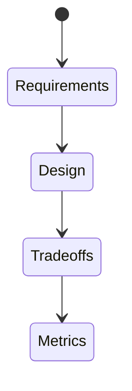
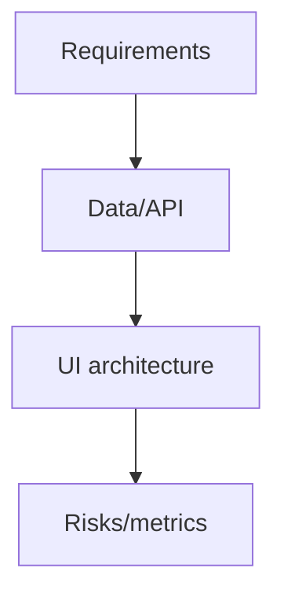
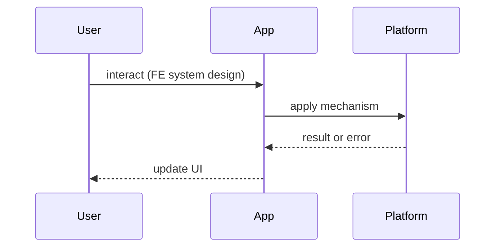

# System Design Interview Questions

<TopicMeta />

<Prerequisites />

::: tip Published
This page meets the handbook **published** bar: deep explanation, ≥10 common mistakes, and official references. Further engine-level errata welcome via PR.
:::

## Introduction

**Frontend system design** bank. Structure answers like product design + FE architecture. Depth topics: [/21-frontend-system-design/](/21-frontend-system-design/).

## Why does it exist?

Senior interviews ask you to design Instagram feed, Notion, or Figma-lite in 45 minutes — scope, API, rendering, offline, and metrics.

## Historical Background

FE system design rose as SPAs gained complexity beyond component trivia.

## Mental Model

**Requirements → constraints → API/data → rendering → state → realtime/offline → a11y/perf → risks.** Draw boxes.

## Internal Workflow

**Q:** Design infinite social feed.  
**A:** Cursors + virtualization — [/21-frontend-system-design/infinite-scroll/](/21-frontend-system-design/infinite-scroll/), [/21-frontend-system-design/pagination/](/21-frontend-system-design/pagination/).

**Q:** Design optimistic like button.  
**A:** [/21-frontend-system-design/optimistic-ui/](/21-frontend-system-design/optimistic-ui/).

**Q:** Design offline notes.  
**A:** [/21-frontend-system-design/offline-first/](/21-frontend-system-design/offline-first/), PWA module.

**Q:** Design search typeahead.  
**A:** [/21-frontend-system-design/search-ui/](/21-frontend-system-design/search-ui/), AbortController.

**Q:** Design file upload.  
**A:** [/21-frontend-system-design/upload-pipelines/](/21-frontend-system-design/upload-pipelines/).

**Q:** Design multi-tenant admin.  
**A:** [/21-frontend-system-design/multi-tenant-ui/](/21-frontend-system-design/multi-tenant-ui/).

**Q:** Design live collaboration presence.  
**A:** [/21-frontend-system-design/realtime-applications/](/21-frontend-system-design/realtime-applications/).

**Q:** Scale a large React org codebase.  
**A:** [/21-frontend-system-design/scaling-react-applications/](/21-frontend-system-design/scaling-react-applications/).

## Lifecycle



## Browser Perspective

Rendering & storage limits.

## JavaScript Engine Perspective

CPU budgets.

## React Perspective

State ownership.

## Next.js Perspective

SSR/RSC choices.

## Server Perspective

API contracts.

## Network Perspective

Latency & fan-out.

## Memory Perspective

Virtualization & caches.

## Performance

Always propose budgets and vitals for the critical journey.

## Production Example

Practice 30-minute designs on a whiteboard/excalidraw weekly.

## Code Examples

```text
Outline template:
1. Goals / non-goals
2. Users & scale assumptions
3. API sketch
4. Client architecture diagram
5. Failure modes
6. Metrics & rollout (flags)
```

## Diagrams





## Common Mistakes

1. Jumping to microservices/microfrontends first
2. No API pagination story
3. Ignoring offline/failure
4. No metrics
5. Designing only happy path
6. Not scoping time
7. Missing a production edge case for 24-interview-preparation.system-design-interview-questions (#1)
8. Missing a production edge case for 24-interview-preparation.system-design-interview-questions (#2)
9. Missing a production edge case for 24-interview-preparation.system-design-interview-questions (#3)
10. Missing a production edge case for 24-interview-preparation.system-design-interview-questions (#4)


## Best Practices

- Clarify requirements aloud
- Draw
- Call out trade-offs
- Link known patterns

## Anti-patterns

- Over-indexing on novel algorithms instead of product constraints

## Comparison

| Prompt | Core topics |
| --- | --- |
| Feed | pagination, virtualization, cache |
| Chat | websocket, reconnect, ordering |
| Docs | offline, conflicts, CRDT/LWW |

## Interview Questions

### Easy

**Q:** How do you start a FE system design interview?

**A:** Clarify requirements, users, scale, and non-goals before drawing.

### Medium

**Q:** Design notifications for a web app.

**A:** In-app store + optional Web Push [/23-pwa-and-offline/push-notifications/](/23-pwa-and-offline/push-notifications/); permission UX; SSE/WS for online fan-out.

### Hard

**Q:** Design a Figma-like multiplayer canvas on the web.

**A:** Discuss canvas/WebGL, input reconciliation, OT/CRDT, presence via WS, performance layering, conflict UX — admit scope; prioritize FE constraints.

## Summary

- Structured design method
- Reuse module 21 patterns
- Failure modes + metrics
- Draw and timebox

## References

- [web.dev — Patterns](https://web.dev/patterns/)
- [React docs — Escape Hatches](https://react.dev/learn/escape-hatches)

<RelatedTopics />


Prev: [`24-interview-preparation.security-interview-questions`](/24-interview-preparation/security-interview-questions/)
