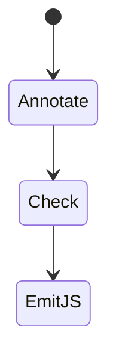
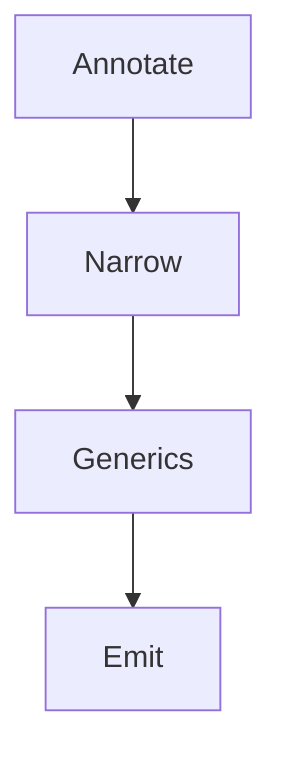
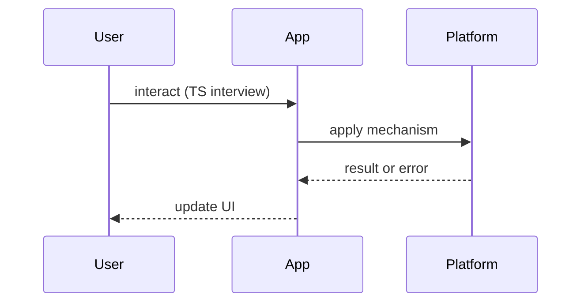

# TypeScript Interview Questions

<TopicMeta />

<Prerequisites />

::: tip Published
This page meets the handbook **published** bar: deep explanation, ≥10 common mistakes, and official references. Further engine-level errata welcome via PR.
:::

## Introduction

**TypeScript** question bank. Canonical: [/07-typescript/](/07-typescript/). Show sound reasoning, not only syntax.

## Why does it exist?

TS interviews probe whether types model domain invariants or just silence `any`.

## Historical Background

TS grew from optional annotations to a structural type system central to FE codebases.

## Mental Model

**Erase to JS at compile time**; types are constraints for soundness and DX. Narrowing is control-flow analysis.

## Internal Workflow

**Q:** type vs interface?  
**A:** [/07-typescript/type-vs-interface/](/07-typescript/type-vs-interface/), [/07-typescript/interfaces/](/07-typescript/interfaces/), [/07-typescript/types/](/07-typescript/types/).

**Q:** Generics why?  
**A:** [/07-typescript/generics/](/07-typescript/generics/).

**Q:** Narrowing / guards?  
**A:** [/07-typescript/type-narrowing/](/07-typescript/type-narrowing/).

**Q:** Utility types?  
**A:** [/07-typescript/utility-types/](/07-typescript/utility-types/).

**Q:** satisfies vs as?  
**A:** [/07-typescript/satisfies/](/07-typescript/satisfies/).

**Q:** Declaration files?  
**A:** [/07-typescript/declaration-files/](/07-typescript/declaration-files/).

## Lifecycle



## Browser Perspective

Emitted JS runs; types don’t.

## JavaScript Engine Perspective

Not applicable.

## React Perspective

See [/07-typescript/typescript-with-react/](/07-typescript/typescript-with-react/).

## Next.js Perspective

Shared types across server/client carefully.

## Server Perspective

Not applicable.

## Network Perspective

Type API responses with zod/io-ts at boundaries.

## Memory Perspective

Not applicable.

## Performance

TS compile time vs `skipLibCheck`; not runtime perf.

## Production Example

Discuss `strict` migration strategy.

## Code Examples

```ts
function isString(x: unknown): x is string {
  return typeof x === 'string'
}
```

## Diagrams





## Common Mistakes

1. Ubiquitous `any`
2. Type assertions instead of narrowing
3. Over-modeling runtime with impossible types
4. Enums by default without need — [/07-typescript/enums-and-alternatives/](/07-typescript/enums-and-alternatives/)
5. Confusing structural typing with nominal
6. Ignoring `strictNullChecks`
7. Missing a production edge case for 24-interview-preparation.typescript-interview-questions (#1)
8. Missing a production edge case for 24-interview-preparation.typescript-interview-questions (#2)
9. Missing a production edge case for 24-interview-preparation.typescript-interview-questions (#3)
10. Missing a production edge case for 24-interview-preparation.typescript-interview-questions (#4)


## Best Practices

- strict true
- Validate at boundaries
- Prefer narrowing to assertions

## Anti-patterns

- `as unknown as T` culture

## Comparison

| Tool | Role |
| --- | --- |
| TS types | Compile-time |
| Zod/etc | Runtime validation |

## Interview Questions

### Easy

**Q:** Does TypeScript change runtime behavior?

**A:** Types are erased; only emitted JS runs — [/07-typescript/compiler/](/07-typescript/compiler/).

### Medium

**Q:** Explain excess property checks.

**A:** Fresh object literals are checked for unknown props when assigned to typed variables — see types handbook pages.

### Hard

**Q:** Type a `useReducer` or builder with generics inference.

**A:** Walk inference, discriminated unions, and [/07-typescript/generics/](/07-typescript/generics/).

## Summary

- Types erase
- Narrowing > assertions
- Link module 07
- strict + boundaries

## References

- [TypeScript Handbook](https://www.typescriptlang.org/docs/handbook/intro.html)
- [TypeScript Release Notes](https://www.typescriptlang.org/docs/handbook/release-notes/overview.html)

<RelatedTopics />


Prev: [`24-interview-preparation.css-interview-questions`](/24-interview-preparation/css-interview-questions/) · Next: [`24-interview-preparation.performance-interview-questions`](/24-interview-preparation/performance-interview-questions/)
