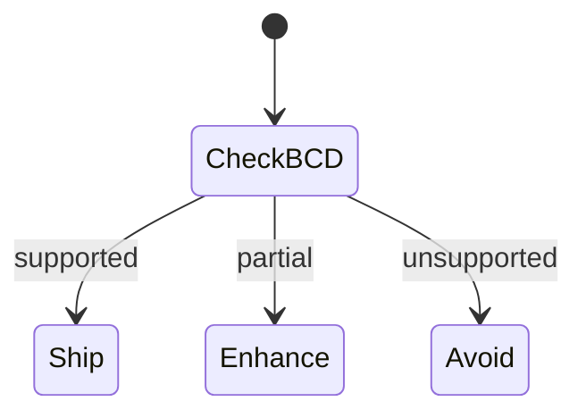
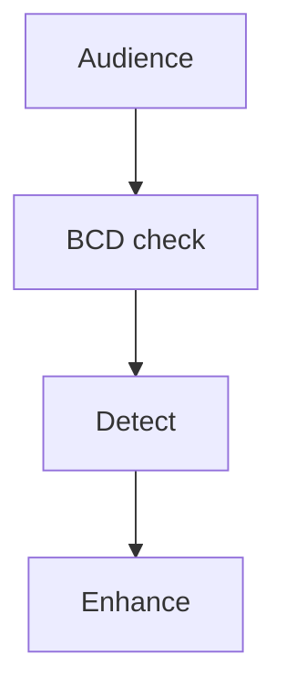
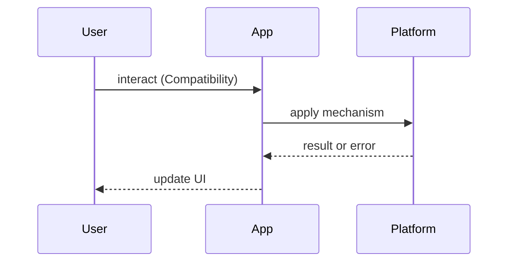

# Browser Compatibility

<TopicMeta />

<Prerequisites />

::: tip Published
This page meets the handbook **published** bar: deep explanation, ≥10 common mistakes, and official references. Further engine-level errata welcome via PR.
:::

## Introduction

**Browser Compatibility** cheatsheet: how to decide support targets and avoid folklore. Prefer Can I Use / MDN BCD over random tweets.

## Why does it exist?

Shipping APIs unsupported by your audience breaks trust. Over-supporting ancient browsers freezes product velocity.

## Historical Background

Browser wars → evergreen browsers → Baseline / BCD efforts to communicate support more clearly.

## Mental Model

**Audience → baseline → detect/polyfill → progressive enhance.** Never UA-parse if feature-detect works.

## Internal Workflow

1. Define supported browsers (product)  
2. Check MDN/Can I Use / Baseline  
3. Feature-detect  
4. Polyfill only critical paths  
5. Test Safari/iOS explicitly for PWAs

## Lifecycle



## Browser Perspective

Engines: Chromium, Gecko, WebKit — test each class.

## JavaScript Engine Perspective

JS features vs Web API features differ.

## React Perspective

Compile target via browserslist.

## Next.js Perspective

Browserslist + SWC targets.

## Server Perspective

Not applicable.

## Network Perspective

Not applicable.

## Memory Perspective

Not applicable.

## Performance

Polyfills cost bytes — ship conditionally.

## Production Example

CI browserslist + Playwright matrix on critical flows.

## Code Examples

```js
if ('IntersectionObserver' in window) {
  // modern path
} else {
  // fallback pagination button
}
```

## Diagrams





## Common Mistakes

1. UA sniffing for features
2. Assuming Chrome === all Chromium embeds
3. Ignoring iOS WebKit
4. Polyfilling everything
5. No documented support policy
6. Testing only desktop
7. Missing a production edge case for 25-appendix.browser-compatibility (#1)
8. Missing a production edge case for 25-appendix.browser-compatibility (#2)
9. Missing a production edge case for 25-appendix.browser-compatibility (#3)
10. Missing a production edge case for 25-appendix.browser-compatibility (#4)


## Best Practices

- Written support policy
- Feature detection
- Real device Safari checks
- Prefer Baseline guidance

## Anti-patterns

- “Works on my Chrome” QA

## Comparison

| Source | Use |
| --- | --- |
| MDN BCD | API tables |
| Can I Use | Quick checks |
| Baseline | Product messaging |

## Interview Questions

### Easy

**Q:** How do you check if an API is safe to use?

**A:** MDN/Can I Use for audience; feature-detect at runtime.

### Medium

**Q:** Feature detection vs UA sniffing?

**A:** Detect capabilities; UA strings lie and rot.

### Hard

**Q:** Set a support policy for a global B2B SaaS.

**A:** Evergreen last N versions, documented exceptions, progressive enhancement for optional APIs, Playwright matrix.

## Summary

- Policy → BCD → detect
- Test WebKit
- Polyfill sparingly
- Document targets

## References

- [MDN — Browser compatibility data](https://developer.mozilla.org/en-US/docs/MDN/Writing_guidelines/Page_structures/Compatibility_tables)
- [Can I Use](https://caniuse.com/)
- [web.dev — Baseline](https://web.dev/baseline)

<RelatedTopics />


Next: [`25-appendix.http-status-codes`](/25-appendix/http-status-codes/)
