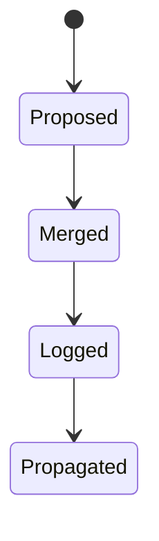
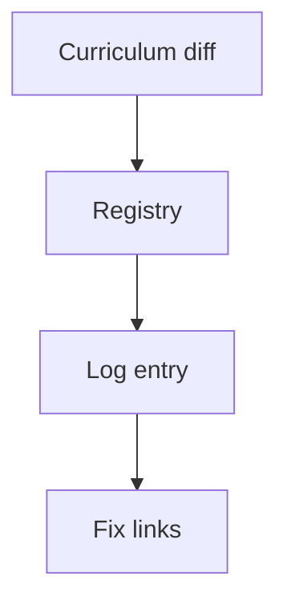
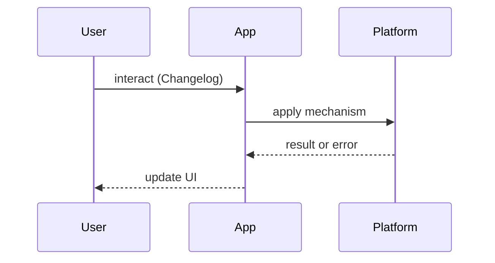

# Curriculum Changelog

<TopicMeta />

<Prerequisites />

::: tip Published
This page meets the handbook **published** bar: deep explanation, ≥10 common mistakes, and official references. Further engine-level errata welcome via PR.
:::

## Introduction

**Curriculum Changelog** is the denser log of structural handbook changes — added/removed topics, renames, module reshuffles — not everyday prose edits.

## Why does it exist?

Learners and contributors need a trail when topic ids move. Broken links and mental maps rot without a changelog.

## Historical Background

This handbook seeds curriculum from `scripts/lib/curriculum-data.ts` into `meta/`; changelog narrates intentional inventory shifts.

## Mental Model

**Inventory diff with intent.** Entry = date + change + migration note (old id → new id).

## Internal Workflow

1. Change curriculum-data / registry  
2. Run registry pipelines  
3. Note migration in changelog  
4. Fix links

## Lifecycle



## Browser Perspective

Not applicable.

## JavaScript Engine Perspective

Not applicable.

## React Perspective

Not applicable.

## Next.js Perspective

Docs rebuild picks up moves.

## Server Perspective

Not applicable.

## Network Perspective

Not applicable.

## Memory Perspective

Not applicable.

## Performance

Docs-only concern: keep the changelog short so humans actually read it.

## Production Example

Major renames get a short migration blurb in PR + changelog.

## Code Examples

```md
## 2026-08-05
- Added: 21-frontend-system-design.search-ui
- Renamed: 06-javascript.eventloop → 06-javascript.event-loop-js
- Note: update cross-links
```

## Diagrams





## Common Mistakes

1. Silent renames
2. Logging typo fixes as curriculum events
3. No migration path for old ids
4. Changelog without dates
5. Forgetting learning paths updates
6. Breaking depends_on cycles unnoticed
7. Missing a production edge case for 25-appendix.curriculum-changelog (#1)
8. Missing a production edge case for 25-appendix.curriculum-changelog (#2)
9. Missing a production edge case for 25-appendix.curriculum-changelog (#3)
10. Missing a production edge case for 25-appendix.curriculum-changelog (#4)


## Best Practices

- Log structural changes only
- Include old→new ids
- Run verify after moves

## Anti-patterns

- Rewriting history to hide breaking moves

## Comparison

| Change type | Log? |
| --- | --- |
| Topic add/remove/rename | Yes |
| Prose edit | No |
| Tag tweak | Optional |

## Interview Questions

### Easy

**Q:** What belongs in a curriculum changelog?

**A:** Structural inventory changes — not every sentence edit.

### Medium

**Q:** Why are stable topic ids important?

**A:** Cross-links, learning paths, and KG edges depend on them.

### Hard

**Q:** How do you migrate a split topic safely?

**A:** Create new ids, redirect/link old path, update registry & paths, log migration, run link checker.

## Summary

- Log structural diffs
- Migrate ids explicitly
- Keep prose out
- Verify links

## References

- [Keep a Changelog](https://keepachangelog.com/)
- See CONTRIBUTING.md for registry workflow

<RelatedTopics />


Prev: [`25-appendix.glossary-export`](/25-appendix/glossary-export/) · Next: [`25-appendix.further-reading-policy`](/25-appendix/further-reading-policy/)
