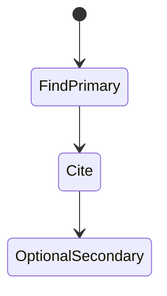
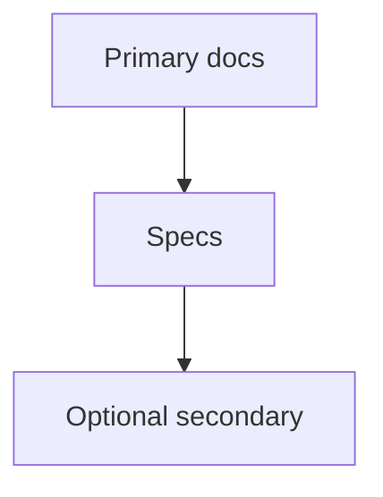
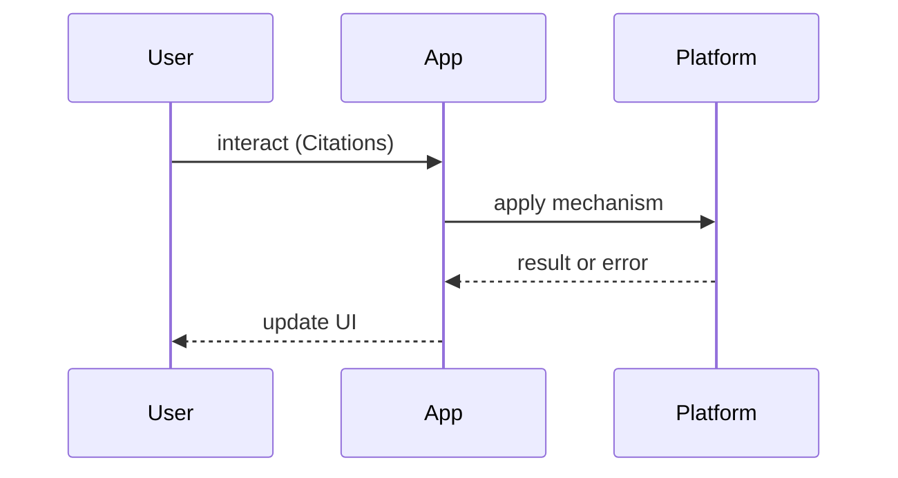

# Further Reading Policy

<TopicMeta />

<Prerequisites />

::: tip Published
This page meets the handbook **published** bar: deep explanation, ≥10 common mistakes, and official references. Further engine-level errata welcome via PR.
:::

## Introduction

**Further Reading Policy** states what belongs in topic **References** and optional further reading. Official docs first; secondary sources carefully.

## Why does it exist?

Blog rot and conflicting advice confuse learners. The handbook privileges specifications and primary documentation.

## Historical Background

Documentation-standard in this repo requires official references for draft+ status.

## Mental Model

**Primary > secondary > opinion.** Primary = specs, MDN, react.dev, RFCs. Secondary = eng blogs with unique data. Avoid SEO content farms.

## Internal Workflow

1. Cite official docs for behaviors  
2. Add RFCs/specs when precise  
3. Optionally one high-quality secondary  
4. Date-sensitive posts: note year  
5. Never paywall-only as sole citation

## Lifecycle



## Browser Perspective

MDN + specs for Web APIs.

## JavaScript Engine Perspective

Implementation blogs OK as secondary.

## React Perspective

react.dev first.

## Next.js Perspective

nextjs.org/docs first.

## Server Perspective

Not applicable.

## Network Perspective

RFCs for HTTP.

## Memory Perspective

Not applicable.

## Performance

N/A

## Production Example

PR review rejects topics citing only medium spam.

## Code Examples

```md
## References
- [MDN — Service Worker API](https://developer.mozilla.org/en-US/docs/Web/API/Service_Worker_API)
- [web.dev — PWA](https://web.dev/explore/progressive-web-apps)
# Optional further reading
- High-quality eng blog with unique benchmarks (YYYY)
```

## Diagrams





## Common Mistakes

1. Blog-only references for normative behavior
2. Outdated posts contradicting current specs
3. Affiliate junk links
4. No references on draft pages
5. Citing unmaintained forks of docs
6. Deep links that 404 without archive
7. Missing a production edge case for 25-appendix.further-reading-policy (#1)
8. Missing a production edge case for 25-appendix.further-reading-policy (#2)
9. Missing a production edge case for 25-appendix.further-reading-policy (#3)
10. Missing a production edge case for 25-appendix.further-reading-policy (#4)


## Best Practices

- Official first
- RFCs when precise
- Label secondary as further reading
- Prefer stable URLs

## Anti-patterns

- Reference sections as SEO link farms

## Comparison

| Source | Authority |
| --- | --- |
| Spec/RFC | Highest |
| Official docs | High |
| Eng blog | Contextual |
| Random tutorial | Low |

## Interview Questions

### Easy

**Q:** What should References prefer?

**A:** Official documentation and specifications.

### Medium

**Q:** When is an engineering blog acceptable?

**A:** When it provides unique measurements or historical context, alongside primary citations.

### Hard

**Q:** How do you resolve conflicting blog vs spec guidance?

**A:** Trust the spec/official docs; treat blogs as possibly outdated; verify in browsers.

## Summary

- Official docs first
- Secondary optional
- Required for drafts
- Avoid junk citations

## References

- [MDN Web Docs](https://developer.mozilla.org/)
- [TC39 / ECMAScript](https://tc39.es/)
- [CONTRIBUTING.md](/CONTRIBUTING.md) — handbook ground rules

<RelatedTopics />


Prev: [`25-appendix.curriculum-changelog`](/25-appendix/curriculum-changelog/)
