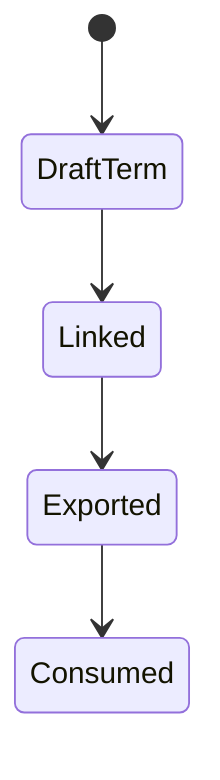
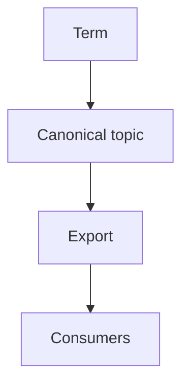
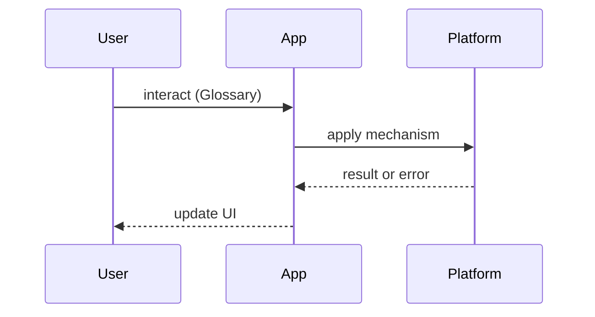

# Glossary Export

<TopicMeta />

<Prerequisites />

::: tip Published
This page meets the handbook **published** bar: deep explanation, ≥10 common mistakes, and official references. Further engine-level errata welcome via PR.
:::

## Introduction

**Glossary Export** explains the handbook’s glossary artifact: stable term definitions reused by topics and knowledge-graph views.

## Why does it exist?

Shared vocabulary prevents “event loop” meaning three things across modules. Export keeps tooling and docs aligned.

## Historical Background

This curriculum stores structured meta (registry, tags, KG) alongside prose; glossary export is the term layer.

## Mental Model

**Term id → short definition → canonical topic link.** Topics should not redefine casually; they link.

## Internal Workflow

1. Add/update term in glossary source  
2. Link canonical topic  
3. Regenerate export if required by tooling  
4. Use consistent term in prose

## Lifecycle



## Browser Perspective

Not applicable.

## JavaScript Engine Perspective

Not applicable.

## React Perspective

Not applicable.

## Next.js Perspective

Docs site may render glossary pages from export.

## Server Perspective

Not applicable.

## Network Perspective

Not applicable.

## Memory Perspective

Not applicable.

## Performance

N/A beyond docs build size — keep definitions short.

## Production Example

When renaming a term, update glossary + registry links together.

## Code Examples

```yaml
# Illustrative shape
- id: event-loop
  term: Event Loop
  definition: Scheduler coordinating tasks, microtasks, and rendering in browsers.
  canonical: 03-browser.event-loop
```

## Diagrams





## Common Mistakes

1. Duplicate conflicting definitions
2. Glossary without canonical links
3. Rewriting definitions ad hoc per page
4. Unstable ids
5. Overlong glossary essays
6. Orphan terms never used
7. Missing a production edge case for 25-appendix.glossary-export (#1)
8. Missing a production edge case for 25-appendix.glossary-export (#2)
9. Missing a production edge case for 25-appendix.glossary-export (#3)
10. Missing a production edge case for 25-appendix.glossary-export (#4)


## Best Practices

- One canonical topic per term
- Short definitions
- Stable ids
- Update with curriculum changes

## Anti-patterns

- Glossary as dumping ground for unwritten topics

## Comparison

| Artifact | Role |
| --- | --- |
| Glossary | Terms |
| Topic registry | Pages |
| Knowledge graph | Relationships |

## Interview Questions

### Easy

**Q:** Why have a glossary in a handbook?

**A:** Shared definitions reduce ambiguity across modules.

### Medium

**Q:** What should a glossary entry link to?

**A:** A canonical topic that owns the deep explanation.

### Hard

**Q:** How do you prevent glossary drift?

**A:** Stable ids, review on curriculum changes, forbid conflicting inline redefinitions.

## Summary

- Term → definition → canonical topic
- Keep short
- Stable ids
- Align with registry/KG

## References

- [W3C — making content understandable (vocab clarity)](https://www.w3.org/WAI/)
- Prefer this repo’s meta/ glossary sources as authoritative for local terms.

<RelatedTopics />


Prev: [`25-appendix.priority-hints-cheatsheet`](/25-appendix/priority-hints-cheatsheet/) · Next: [`25-appendix.curriculum-changelog`](/25-appendix/curriculum-changelog/)
