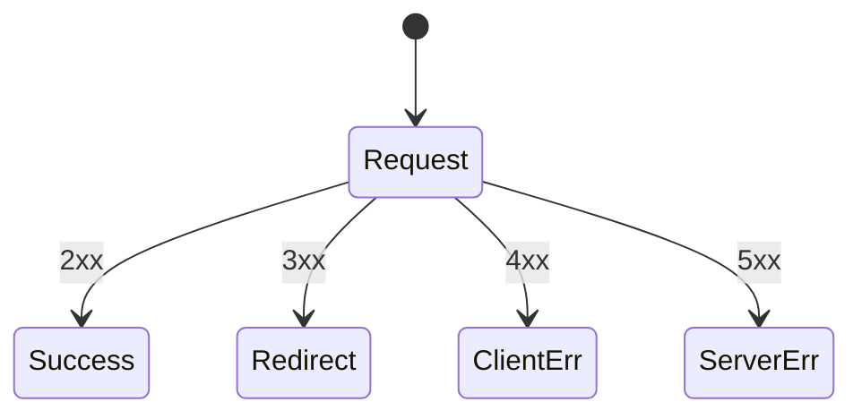
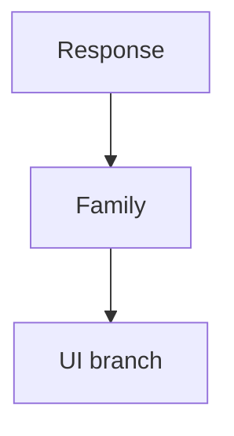
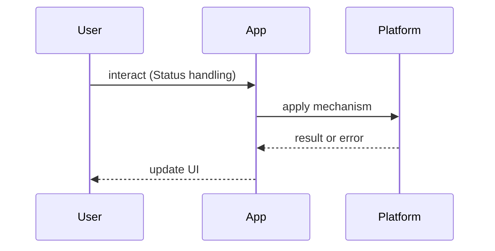

# HTTP Status Codes

<TopicMeta />

<Prerequisites />

::: tip Published
This page meets the handbook **published** bar: deep explanation, ≥10 common mistakes, and official references. Further engine-level errata welcome via PR.
:::

## Introduction

**HTTP Status Codes** denser reference for FE work. Semantics: [/02-internet/http/](/02-internet/http/).

## Why does it exist?

UI error handling branches on status families. Mis-handling 401/403/304 causes auth and cache bugs.

## Historical Background

Status codes standardized across HTTP revisions (RFC 9110 semantics).

## Mental Model

**1xx** info · **2xx** success · **3xx** redirect · **4xx** client · **5xx** server. FE cares especially about 200/201/204/301/302/304/400/401/403/404/409/422/429/500/503.

## Internal Workflow

Map UI: retryable (408/429/5xx) vs auth (401/403) vs user fix (400/422) vs missing (404).

## Lifecycle



## Browser Perspective

Follows redirects; exposes status on fetch Response.

## JavaScript Engine Perspective

Not applicable.

## React Perspective

Query libraries branch on status.

## Next.js Perspective

Route Handlers should set correct codes.

## Server Perspective

Don’t overload 200 for errors.

## Network Perspective

Caches key off status + headers.

## Memory Perspective

Not applicable.

## Performance

304 Not Modified saves bandwidth.

## Production Example

Standardize error envelope + status; log correlation ids.

## Code Examples

```ts
if (res.status === 401) logout()
else if (res.status === 429) backoff()
else if (!res.ok) throw new Error(String(res.status))
```

| Code | Meaning (FE note) |
| --- | --- |
| 200 | OK |
| 201 | Created |
| 204 | No content |
| 301/302 | Redirect |
| 304 | Use cache |
| 400 | Bad request |
| 401 | Unauthenticated |
| 403 | Forbidden |
| 404 | Not found |
| 409 | Conflict |
| 422 | Validation |
| 429 | Rate limit |
| 500/503 | Server/unavailable |

## Diagrams





## Common Mistakes

1. Treating all non-200 as identical
2. Confusing 401 and 403
3. Ignoring 304
4. Error JSON with HTTP 200
5. Retrying 400 loops
6. Not handling 429 backoff
7. Missing a production edge case for 25-appendix.http-status-codes (#1)
8. Missing a production edge case for 25-appendix.http-status-codes (#2)
9. Missing a production edge case for 25-appendix.http-status-codes (#3)
10. Missing a production edge case for 25-appendix.http-status-codes (#4)


## Best Practices

- Branch by family + specific codes
- Surface retryable errors differently
- Respect Retry-After

## Anti-patterns

- alert(status) for every failure

## Comparison

| 401 | 403 |
| --- | --- |
| Who are you? | I know you; not allowed |

## Interview Questions

### Easy

**Q:** What does 304 mean?

**A:** Not Modified — revalidate success; use cached representation.

### Medium

**Q:** 401 vs 403?

**A:** 401 authentication missing/failed; 403 authenticated but not authorized.

### Hard

**Q:** How should a SPA handle 401 mid-session?

**A:** Refresh/session renew once; else logout and preserve return URL; avoid retry storms.

## Summary

- Know FE-critical codes
- Branch UX by meaning
- 304 matters for caches
- Link full HTTP topic

## References

- [MDN — HTTP response status codes](https://developer.mozilla.org/en-US/docs/Web/HTTP/Status)
- [RFC 9110 — Status Codes](https://www.rfc-editor.org/rfc/rfc9110#name-status-codes)

<RelatedTopics />


Prev: [`25-appendix.browser-compatibility`](/25-appendix/browser-compatibility/) · Next: [`25-appendix.mime-types`](/25-appendix/mime-types/)
