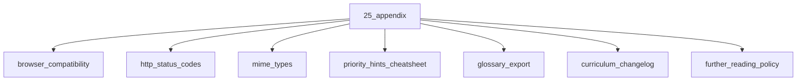

# Appendix

## Scope

Cheatsheets, compatibility tables, and curriculum changelog

## Prerequisites

See the learning paths and each topic's prerequisites in the registry.

## Topics in order

- [Browser Compatibility](/25-appendix/browser-compatibility/) — junior, ~20 min
- [HTTP Status Codes](/25-appendix/http-status-codes/) — beginner, ~15 min
- [MIME Types](/25-appendix/mime-types/) — beginner, ~10 min
- [Priority Hints Cheatsheet](/25-appendix/priority-hints-cheatsheet/) — mid, ~15 min
- [Glossary Export](/25-appendix/glossary-export/) — beginner, ~10 min
- [Curriculum Changelog](/25-appendix/curriculum-changelog/) — beginner, ~10 min
- [Further Reading Policy](/25-appendix/further-reading-policy/) — beginner, ~10 min

## Module knowledge graph

## Suggested learning paths

Browse [Learning Paths](/learning-paths/).
