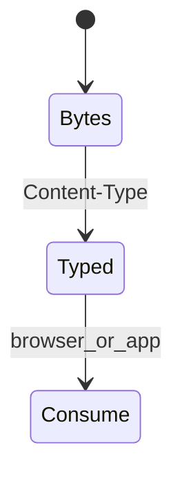
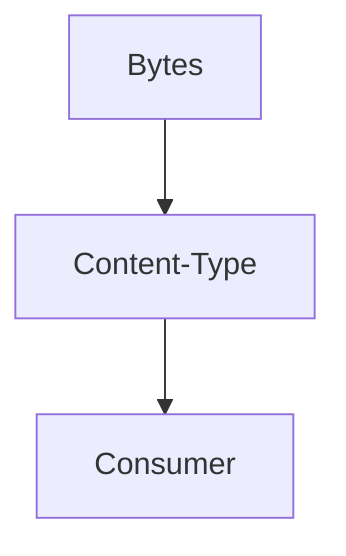
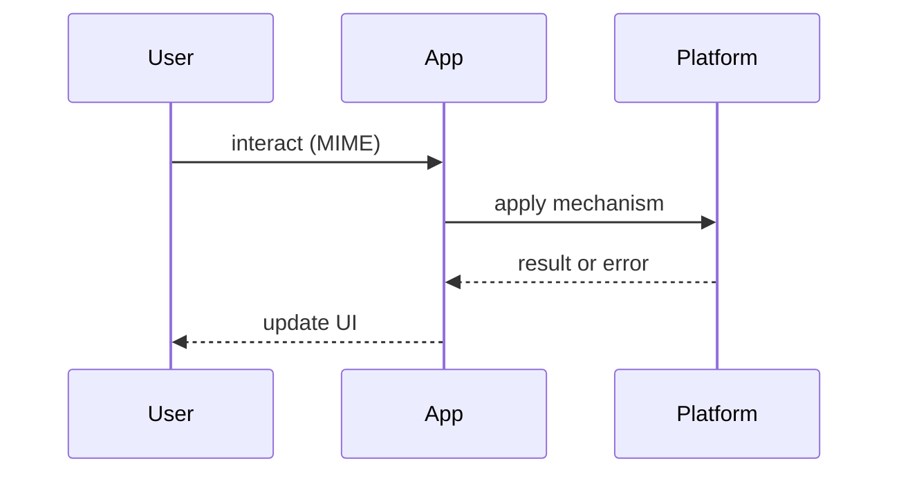

# MIME Types

<TopicMeta />

<Prerequisites />

::: tip Published
This page meets the handbook **published** bar: deep explanation, ≥10 common mistakes, and official references. Further engine-level errata welcome via PR.
:::

## Introduction

**MIME Types** (`Content-Type`) identify payload formats. Critical for uploads, workers, manifests, and security sniffing defenses.

## Why does it exist?

Wrong MIME breaks modules, SW, fonts, and can enable content sniffing attacks.

## Historical Background

MIME originated in email; HTTP adopted `Content-Type` widely.

## Mental Model

`type/subtype` (+ parameters like `charset=utf-8`). Browsers may sniff; servers should send accurate types + `X-Content-Type-Options: nosniff` when appropriate.

## Internal Workflow

Serve correct types; validate uploads server-side; don’t trust `File.type` alone.

## Lifecycle



## Browser Perspective

Modules require correct JS MIME; modules/CORS interplay.

## JavaScript Engine Perspective

Not applicable.

## React Perspective

Not applicable.

## Next.js Perspective

Static asset headers via platform config.

## Server Perspective

Set types explicitly.

## Network Perspective

Caches can Vary on Content-Type rarely needed.

## Memory Perspective

Not applicable.

## Performance

Compression (`Content-Encoding`) separate from MIME.

## Production Example

CDN maps: `.js` → `text/javascript`, `.webmanifest` → `application/manifest+json`.

## Code Examples

| Extension | MIME |
| --- | --- |
| .html | text/html; charset=utf-8 |
| .js / .mjs | text/javascript |
| .css | text/css |
| .json | application/json |
| .webmanifest | application/manifest+json |
| .svg | image/svg+xml |
| .woff2 | font/woff2 |
| .wasm | application/wasm |
| .png/.jpg/.webp | image/* |

```http
Content-Type: application/json; charset=utf-8
X-Content-Type-Options: nosniff
```

## Diagrams





## Common Mistakes

1. Serving JS as text/plain breaking modules
2. Trusting client MIME on uploads
3. Wrong manifest MIME
4. Missing charset on text
5. SVG as image/svg without XSS caution
6. Assuming File.type is authoritative
7. Missing a production edge case for 25-appendix.mime-types (#1)
8. Missing a production edge case for 25-appendix.mime-types (#2)
9. Missing a production edge case for 25-appendix.mime-types (#3)
10. Missing a production edge case for 25-appendix.mime-types (#4)


## Best Practices

- Explicit server mapping
- nosniff for untrusted content
- Server-side file validation

## Anti-patterns

- application/octet-stream for everything

## Comparison

| Layer | Role |
| --- | --- |
| Content-Type | Representation type |
| Content-Encoding | gzip/br wrapper |

## Interview Questions

### Easy

**Q:** What header declares JSON?

**A:** `Content-Type: application/json`.

### Medium

**Q:** Why does ES module script fail with wrong MIME?

**A:** Browsers require appropriate JS MIME for module scripts.

### Hard

**Q:** How do MIME types interact with upload security?

**A:** Client hints are untrusted; sniff/validate server-side; careful with SVG/HTML executable types in open buckets.

## Summary

- Correct Content-Type matters
- Don’t trust upload MIME
- Know common web types
- nosniff when needed

## References

- [MDN — MIME types](https://developer.mozilla.org/en-US/docs/Web/HTTP/MIME_types)
- [IANA Media Types](https://www.iana.org/assignments/media-types/media-types.xhtml)

<RelatedTopics />


Prev: [`25-appendix.http-status-codes`](/25-appendix/http-status-codes/) · Next: [`25-appendix.priority-hints-cheatsheet`](/25-appendix/priority-hints-cheatsheet/)
