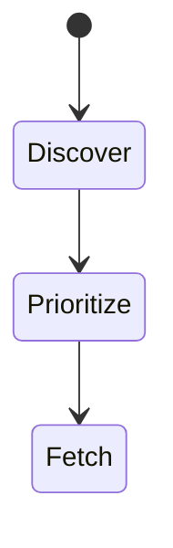
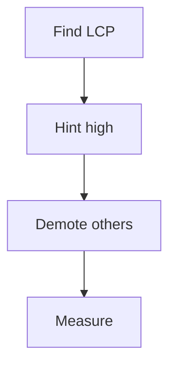
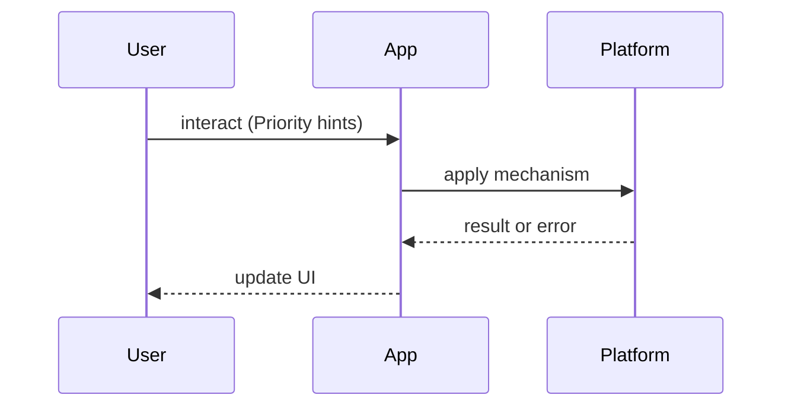

# Priority Hints Cheatsheet

<TopicMeta />

<Prerequisites />

::: tip Published
This page meets the handbook **published** bar: deep explanation, ≥10 common mistakes, and official references. Further engine-level errata welcome via PR.
:::

## Introduction

**Priority Hints** cheatsheet for critical resource scheduling: `fetchpriority` on images/scripts, plus related preload/preconnect hints. Deep HTML: [/04-html/preload/](/04-html/preload/), [/04-html/preconnect/](/04-html/preconnect/).

## Why does it exist?

Browsers guess priorities; LCP images often need a boost; non-critical images should not compete.

## Historical Background

Priority Hints emerged to complement preload scanner heuristics; `fetchpriority` standardized for content authors.

## Mental Model

**High** for LCP candidates · **auto** default · **low** for below-fold. Hints are not guarantees.

## Internal Workflow

Identify LCP → mark hero `fetchpriority="high"` → lazy below-fold → preload only critical → measure.

## Lifecycle



## Browser Perspective

Scheduler uses hints with heuristics.

## JavaScript Engine Perspective

Not applicable.

## React Perspective

next/image often exposes priority prop.

## Next.js Perspective

priority on Image for LCP.

## Server Perspective

Not applicable.

## Network Perspective

Competes on bandwidth/HTTP/2 multiplexing.

## Memory Perspective

Not applicable.

## Performance

Primary goal: better LCP without starving critical CSS/JS.

## Production Example

Hero image high; carousel thumbs low; avoid marking everything high.

## Code Examples

```html


<link rel="preload" as="image" href="/hero.avif" fetchpriority="high" />
<link rel="preconnect" href="https://cdn.example.com" />
```

## Diagrams





## Common Mistakes

1. fetchpriority=high on many assets
2. Preloading the whole site
3. Fighting the browser with contradictory hints
4. Forgetting dimensions → CLS
5. Priority without compression/format wins
6. Ignoring mobile field data
7. Missing a production edge case for 25-appendix.priority-hints-cheatsheet (#1)
8. Missing a production edge case for 25-appendix.priority-hints-cheatsheet (#2)
9. Missing a production edge case for 25-appendix.priority-hints-cheatsheet (#3)
10. Missing a production edge case for 25-appendix.priority-hints-cheatsheet (#4)


## Best Practices

- One/few high-priority LCP resources
- Lazy load below-fold
- Validate with Performance panel

## Anti-patterns

- Cargo-cult preload of every font/image

## Comparison

| Hint | Role |
| --- | --- |
| fetchpriority | Priority bias |
| preload | Early discovery |
| preconnect | Early connection |

## Interview Questions

### Easy

**Q:** What does fetchpriority="high" on an image do?

**A:** Hints the browser to prioritize that image fetch — useful for LCP heroes.

### Medium

**Q:** preload vs fetchpriority?

**A:** preload discovers early; fetchpriority biases priority; often used together for LCP images.

### Hard

**Q:** When can priority hints hurt?

**A:** Over-high contention delays CSS/JS; measure waterfalls before/after.

## Summary

- Boost LCP, demote noise
- Hints ≠ guarantees
- Combine with preload carefully
- Measure vitals

## References

- [MDN — fetchpriority](https://developer.mozilla.org/en-US/docs/Web/API/HTMLImageElement/fetchPriority)
- [web.dev — Priority Hints](https://web.dev/articles/fetch-priority)

<RelatedTopics />


Prev: [`25-appendix.mime-types`](/25-appendix/mime-types/) · Next: [`25-appendix.glossary-export`](/25-appendix/glossary-export/)
