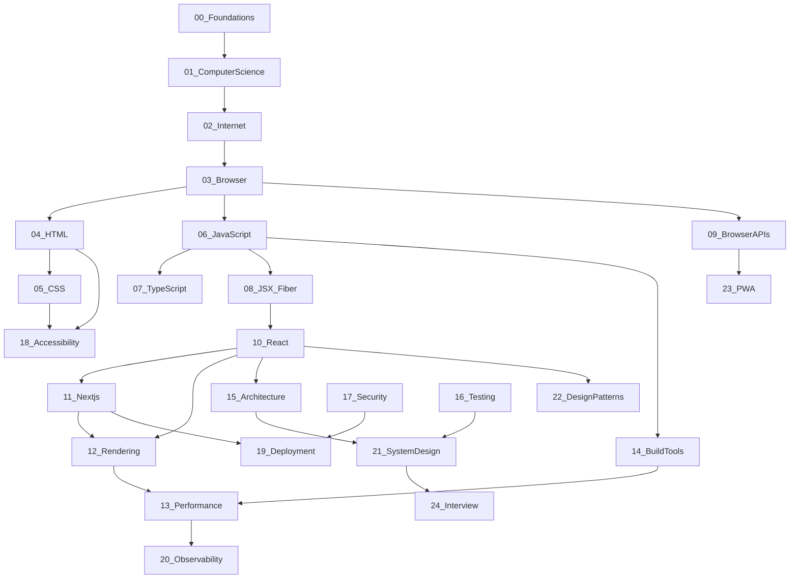
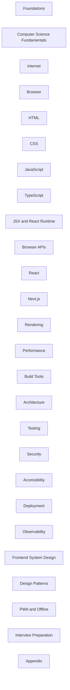

# Knowledge Graph Overview

::: info Generated
This page is generated by `pnpm registry:knowledge-graph`. Edit edges via `meta/topic-registry.yaml` / `scripts/seed-meta.ts`.
:::

## Module dependencies

## Modules

## Stats

| Metric | Value |
| --- | --- |
| Modules | 26 |
| Topics | 453 |
| Stub topics | 0 |

## Edge dump

Machine-readable edges: [`meta/knowledge-graph.yaml`](../../../meta/knowledge-graph.yaml).
