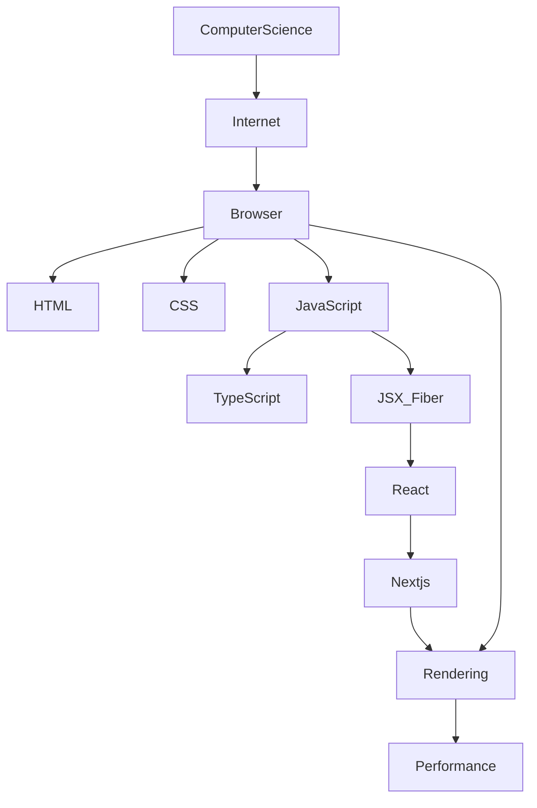

# Start Here

This handbook teaches **how the modern web works**, from computer science and networking through browser internals to React, Next.js, and production systems.

It is not a React tutorial. Frameworks appear only after the platforms they run on.

## Pick your entry

<LearningPathNav />

| If you are… | Start with |
| --- | --- |
| New to programming / web | [Beginner path](/learning-paths/beginner) |
| Junior frontend | [Junior path](/learning-paths/junior) |
| Mid-level deepening internals | [Mid-level path](/learning-paths/mid-level) |
| Senior / staff leveling up systems | [Senior path](/learning-paths/senior) |
| Backend → frontend | [Backend to Frontend](/learning-paths/backend-to-frontend) |
| Interview prep | [Interview path](/learning-paths/interview-prep) |

## How pages are written

Every topic follows the same deep template: why → history → mental model → internals → perspectives → performance → mistakes → interview questions.

Details: [How to use this handbook](/how-to-use) and the foundations module ([How to Read This Handbook](/00-foundations/how-to-read-this-handbook/)).

## Map of the stack

Next: [How the Web Works Map](/00-foundations/how-the-web-works-map/).
