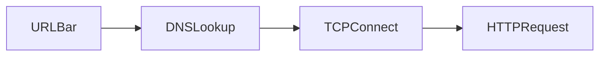

# Diagram Standard

Prefer Mermaid in Markdown. Export static SVG only when Mermaid cannot express the idea.

## Allowed Mermaid types

- `flowchart` — processes, CRP, decision trees
- `sequenceDiagram` — request/response, hydration, TLS handshake
- `stateDiagram-v2` — lifecycles (service worker, React fiber phases)
- `classDiagram` — sparingly, for type/API shapes
- `erDiagram` — only for storage models

## Node ID rules

- CamelCase or snake_case IDs — **no spaces**
- Labels with special characters go in double quotes: `A["Process (main)"]`
- Do not use reserved words as IDs: `end`, `subgraph`, `graph`, `flowchart`
- Subgraphs: `subgraph id [Label]`

## Forbidden

- Custom `style` / `classDef` colors (breaks dark mode)
- HTML / angle brackets inside labels
- Click events (`click` syntax)
- Overcrowded graphs (>25 nodes) — split into multiple diagrams

## Sequence diagram tips

- Participants: short CamelCase ids, readable labels
- Show failure paths when teaching protocols or rendering

## Placement

- Teaching diagrams live under `## Diagrams`
- A critical mental-model diagram may also appear under `## Mental Model`
- Caption above or below with one sentence stating what to notice

## Static images

- SVG preferred; PNG for screenshots (DevTools)
- Alt text required
- Max content width guidance: design for 720–960px readable width
- File names: `kebab-case.svg`
